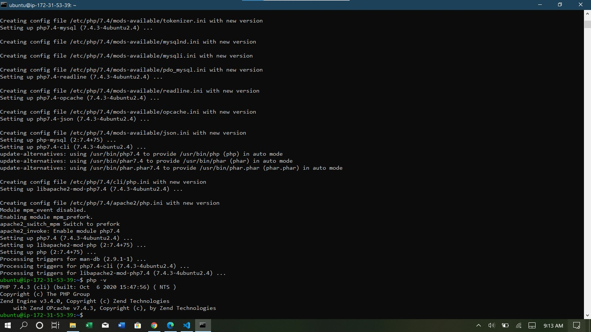
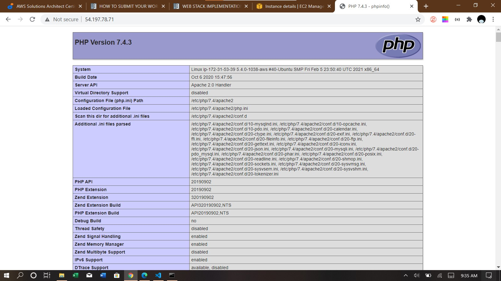

**Step 1: Installing Apache**
  - Command: sudo apt install apache2
  

**Step 2: Enable ufw and allow Apache server**
  - Commands: 
      - sudo ufw enable
      - sudo ufw allow "Apache"
  

**Step 3: Install MySQL Server and Setup Root Password**
  - Commands:
    - sudo apt install mysql-server
    - sudo mysql_secure_installation
  

**Step 4: Install PHP and Core Packages**
  - Command: sudo apt install php libapache2-mod-php php-mysql 
  

**Step 5: Setup VirtualHost on Apache to Serve PHP**
  - Commands:
    - sudo mkdir /var/www/projectlamp (Create project directory)
    - sudo chown -R \$USER:$USER /var/www/projectlamp (Change user ownerships)
    - sudo vim /etc/apache2/sites-available/projectlamp.conf (Create Virtual Host conf for project)
    - sudo a2ensite projectlamp (Enable project)
    - sudo a2dissite 000-default (Disable default site)
    - sudo apache2ctl configtest (Test configurations)
    - sudo systemctl reload apache2 (Reload Apache2 service)
  

**Step 6: Enable PHP on the Website**
  - Commands:
    - sudo vim /etc/apache2/mods-enabled/dir.conf (Edit dir.conf to place index.php at higher precedence)
    - vim /var/www/projectlamp/index.php (Create PHP index page)
  