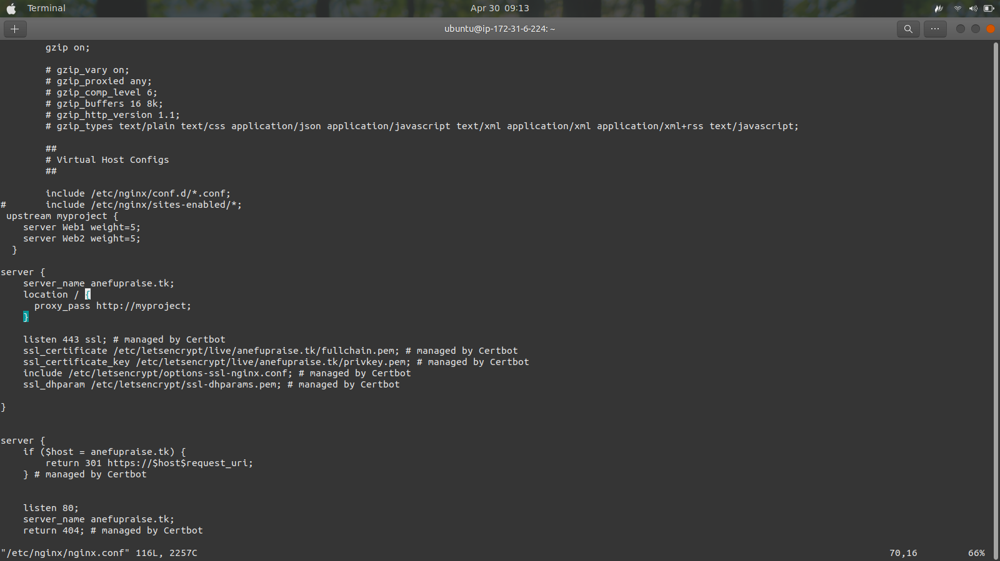
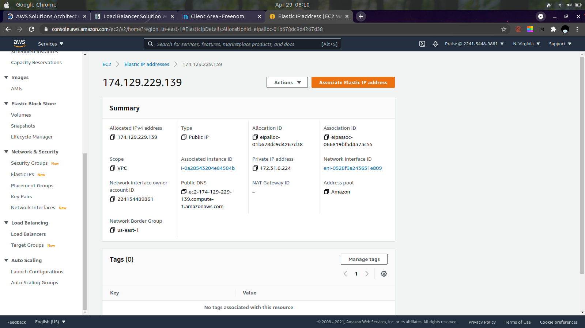
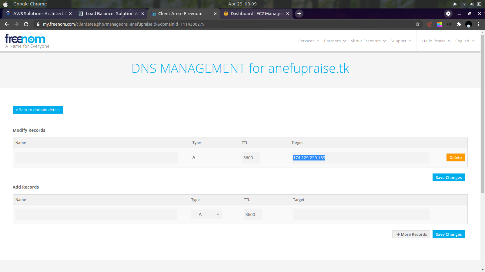
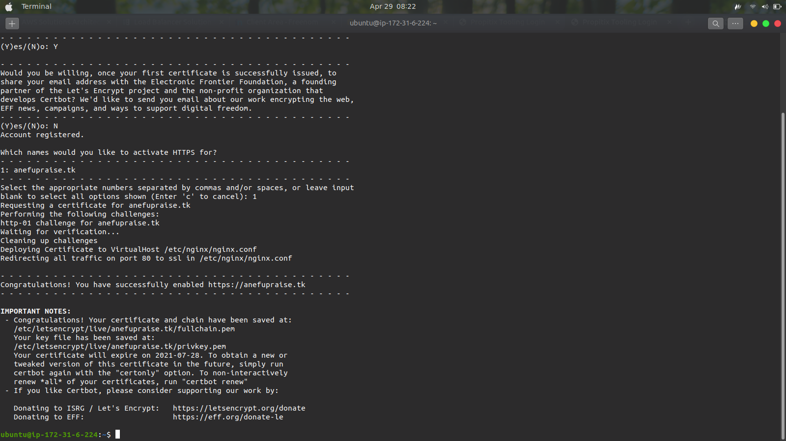
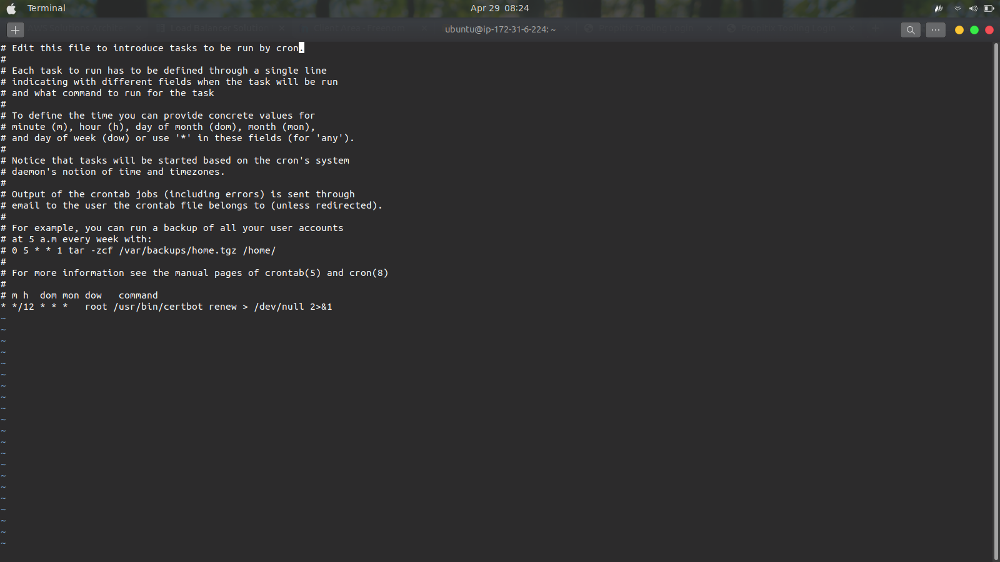

# Step 1: Configure NGINX as a Load Balancer
- ## Uninstall apache from the existing load balancer server or launch a new one
    ```
    sudo apt remove apache
    ```
- ## Open TCP ports 80 and 443 on the lb security group to allow HTTP and HTTPS connections
- ## Update /etc/hosts with the internal ip and hostname for local DNS resolution (only do this is you launched a new lb server)
- ## Install NGINX
    ```
    sudo apt update
    sudo apt install nginx
    ```
- ## Edit the NGINX configuration file (/etc/nginx/nginx.conf) and add the following lines:
    ```
    upstream myproject {
    server Web1 weight=5;
    server Web2 weight=5;
        }

    server {
    listen 80;
    server_name www.domain.com;
    location / {
      proxy_pass http://myproject;
        }
    }
    Comment out this line
    include /etc/nginx/sites-enabled/*;
    ```
    
- ## Restart NGINX service
    ```
    sudo systemctl restart nginx
    ```
# Step 2: Register a new Domain Name and Configure Secured Connection Using SSL/TLS Certificates
- ## To get a valid SSL certificate, you need to register a domain name with a domain name registrar. You can get a free domain name from freenom.com
- ## Assign an Elastic IP to your NGINX load balancer and associate your domain name to the IP.
  
  - From your EC2 management console, select Elastic IPs from the left pane and click "Allocate Elastic IP address" from the top right.
  - After the IP has been provisioned, select it, click Actions and attach it to your lb server.
  - If you got a domain using freenom, click on Services from the top bar, then My Domains and click on Manage Domain on the domain you got.
  - From the page, click Manage Freenom DNS
  - Enter any Name and input the Elastic IP address in the target field. Click save and wait 5-10mins, then enter your domain name in your browser bar. It should load your webpage
    
- ## Configure NGINX to recognize your new domain name
  - Update nginx.conf and change server_name entry from www.domain.com to the domain name you got from freenom
  - Install certbot
    - Make sure snapd service is running
        ```
        sudo systemctl status snapd
        ```
    - Install certbot
        ```
        sudo snap install --classic certbot
        ```
    - Request the certificate for your domain
        ```
        sudo ln -s /snap/bin/certbot /usr/bin/certbot
        sudo certbot --nginx
        ```
        Follow the instructions, you will need to select the domain for which you are requesting a certificate.
        
  - Test secured access to your website by opening https://\<your-domain-name>. You should be able to access the site and should see a padlock icon on your browser's address bar
  - Setup periodic renewal of your certificate
    - By default, LetsEncrypt certificate is valid for 90 days, so it is recommended to renew it at least every 60 days or more frequently. Run:
        ```
        sudo certbot renew --dry-run
        ```
    - Add a cronjob that runs the renew command automatically at a specificied time
        ```
        Run: crontab -e

        Add the following line:

        * */12 * * *   root /usr/bin/certbot renew > /dev/null 2>&1
        ```
        The added cronjob renews the certificate twice a day. You can adjust the schedule if it's too frequent.
        


