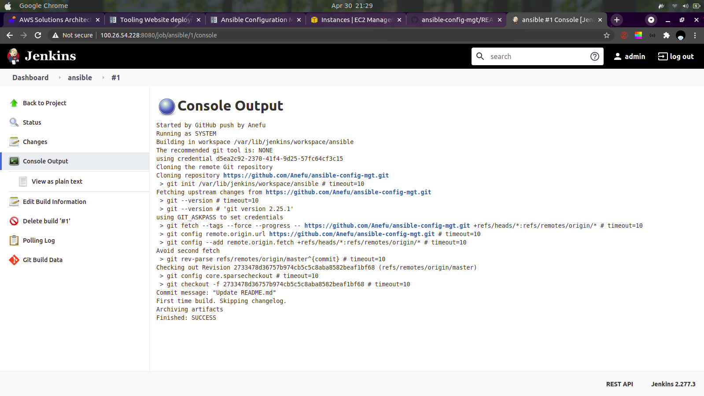
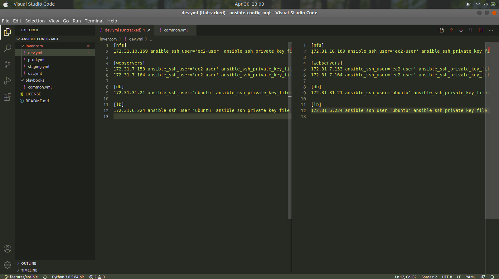
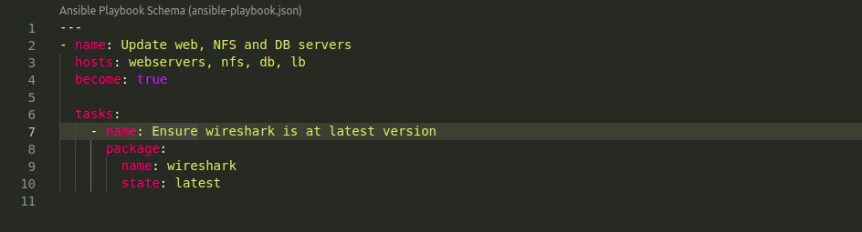
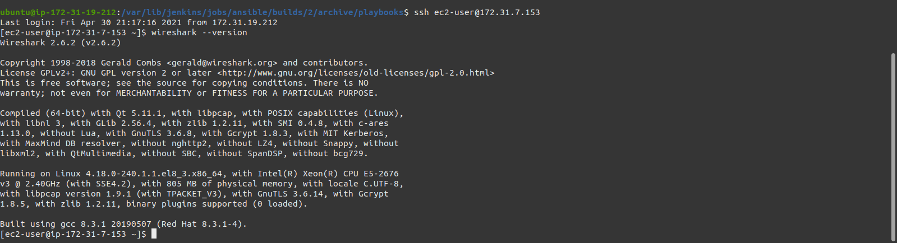

# Step 1: Install and configure Ansible
- ## Update name tag of the Jenkins server to Jenkins-ansible
- ## In your GitHub repo, create a new reposistory named "ansible-config-mgt" 
- ## Install Ansible
    ```
    sudo apt update
    sudo apt install ansible
    ansible --version
    ```
- ## Configure Jenkins build job to save artifacts after every change.
  - Create a Freestyle project named ansible and point it to the ansible-config-mgt repo
  - Configure webhook in GitHub and set the webhook to trigger ansible build.
  - Configure a post-build job to archive the artifacts
    
    Test the configuration by editing your README.md file on GitHub.
    

# Step 2 - Prepare your development environment using Visual Studio Code
- ## Install Visual Studio Code from https://code.visualstudio.com/download

# Step 3: Begin Ansible development
- ## Create a new branch in your ansible-config-mgt repo.
- ## Checkout to the newly created branch
  - Create a playbooks directory for storing playbooks
  - Create an inventory directory for storing inventory files
  - In the playbooks folder, create a common.yml file
  - In the inventory folder, create dev.yml, prod.yml, staging.yml and uat.yml for dev, prod, staging and uat environments respectively.
    
# Step 4: Set up ansible inventory
An Ansible inventory file defines the hosts and groups of hosts upon which commands, modules, and tasks in a playbook operate.
- ## Copy the contents of your private key file to a file on the Jenkins-ansible server and change the permissions to 400.
- ## Update your inventory/dev.yml with:
  ```
    [nfs]
    <NFS-Server-Private-IP-Address> ansible_ssh_user='ec2-user' ansible_ssh_private_key_file=<path-to-.pem-private-key>

    [webservers]
    <Web-Server1-Private-IP-Address> ansible_ssh_user='ec2-user' ansible_ssh_private_key_file=<path-to-.pem-private-key>
    <Web-Server2-Private-IP-Address> ansible_ssh_user='ec2-user' ansible_ssh_private_key_file=<path-to-.pem-private-key>

    [db]
    <Db-Private-IP-Address> ansible_ssh_user='ubuntu' ansible_ssh_private_key_file=<path-to-.pem-private-key>

    [lb]
    <lb-Private-IP-Address> ansible_ssh_user='ubuntu' ansible_ssh_private_key_file=<path-to-.pem-private-key>
    ```
# Step 5: Create a common playbook
- ## Edit the common.yml file with the following configuration
    ```
    ---
    - name: Update web, NFS and DB servers
    hosts: webservers, nfs, db, lb
    become: true

    tasks:
        - name: Ensure wireshark is at latest version
          package:
            name: wireshark
            state: latest
    ```
    
    The playbook uses the Ansible's **package**, a generic package management tool to install the latest version of wireshark on individual servers.

# Step 6: Update repo with latest code
- ## Commit your changes and push to the remote branch
- ## Create a pull request
- ## Merge the pull request with the master branch
    Jenkins should automatically build and archive the artifacts and save them in /var/lib/jenkins/jobs/ansible/builds/<build_number>/archive/ on the Jenkins server
# Step 7: Run Ansible
- ## First of all, run
    ```
    export $ANSIBLE_HOST_KEY_CHECKING=False
    ```
    ## so Ansible does not check your host key when connecting.
- ## Next, run
    ```
    ansible-playbook -i /var/lib/jenkins/jobs/ansible/builds/<build-number>/archive/inventory/dev.yml /var/lib/jenkins/jobs/ansible/builds/<build-number>/archive/playbooks/common.yml
    ```
    You can go to each server and verify that wireshark is installed on each. 
    ```
    wireshark --version
    ```
    

