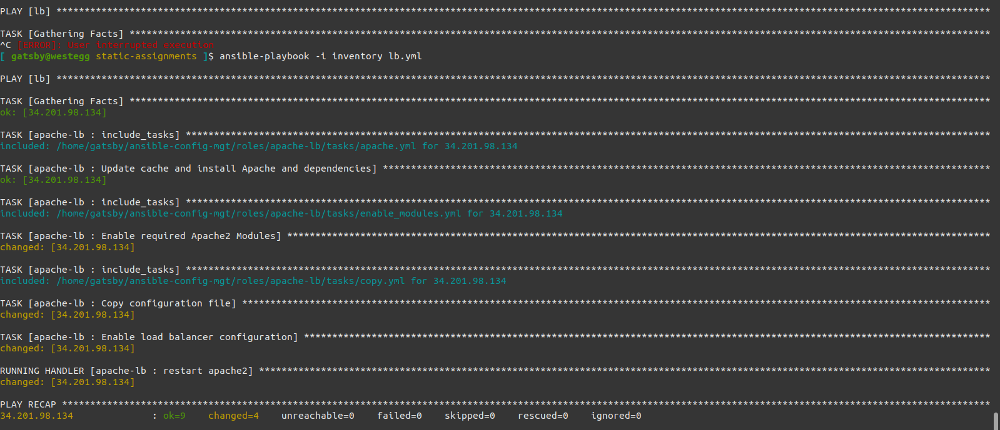
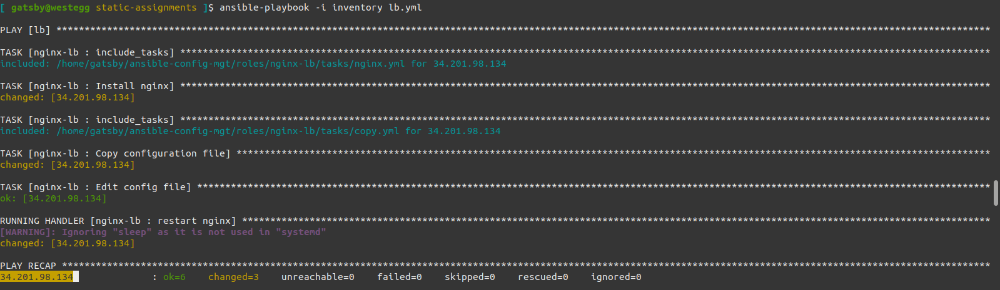
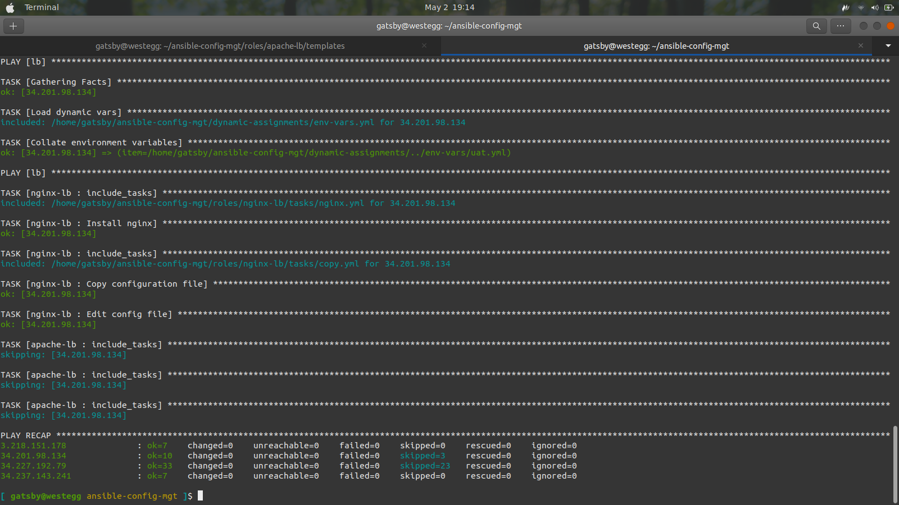

# Step 1: Introducing Dynamic Assignment Into our Structure
- ## In your https://github.com/<your-name>/ansible-config-mgt GitHub repository start a new branch and call it dynamic-assignments
- ## Create a new folder, name it dynamic-assignments. Then inside this folder, create two new files and name them env-vars.yml and default.yml. We will instruct site.yml to include this playbook later. For now, let us keep building up the structure.
  ## Your repo should have a structure like this:
    ```
    ├── dynamic-assignments
    │   └── env-vars.yml
    ├── inventory
    │   └── dev
        └── stage
        └── uat
        └── prod
    └── playbooks
        └── site.yml
    └── roles (optional folder)
        └──...(optional subfolders & files)
    └── static-assignments
        └── common.yml
    ```
- ## Add the following structure:
    ```
    ├── env-vars
        └── dev.yml
        └── stage.yml
        └── uat.yml
        └── prod.yml
    ```
- ## Add the following line to env-vars.yml file:
    ```
    ---
    - name: Collate environment variables
      vars:
        - current_env: uat #Sets current environment to uat
      include_vars: "{{ item }}"
      with_first_found:
        - "../env-vars/{{ current_env }}.yml"
        - "../env-vars/default.yml"
    ```
- ## Update site.yml with dynamic assignments:
    ```
    ---
    - import_playbook: ../static-assignments/common.yml
    - import_playbook: ../static-assignments/webservers.yml
    - import_playbook: ../static-assignments/mysql.yml
    ```
# Step 2: Community roles
- ## We will be using MySQL Role developed by geerlingguy (can be found at https://galaxy.ansible.com/geerlingguy/mysql)
- ## Install the role
    ```
    cd roles
    ansible-galaxy install geerlingguy.mysql
    mv geerlingguy.mysql/ mysql
    ```
- ## Read the README.md file and configure the role as needed.
  - Open defaults/main.yml
  - Configure the defaults as required

# Step 3: Load Balancer roles
- ## You could create your own roles for both nginx and apache (or grab mine from https://github.com/Anefu/ansible-config-mgt/tree/master/roles)
  - Since you cannot use both Nginx and Apache load balancer, you need to add a condition to enable either one - this is where you can make use of variables.
  - Declare a variable in defaults/main.yml file inside the Nginx and Apache roles. Name each variables enable_nginx_lb and enable_apache_lb respectively.
  - Set both values to false like this enable_nginx_lb: false and enable_apache_lb: false.
  - Declare another variable in both roles load_balancer_is_required and set its value to false as well
  - Update both assignment and site.yml files respectively
    
    loadbalancers.yml file:
    ```
    - hosts: lb
      roles:
        - { role: nginx, when: enable_nginx_lb and load_balancer_is_required }
        - { role: apache, when: enable_apache_lb and load_balancer_is_required }
    ```
    sites.yml file:
    ```
    ---
    - import_playbook: ../static-assignments/common.yml
    - import_playbook: ../static-assignments/webservers.yml
    - import_playbook: ../static-assignments/mysql.yml

    - hosts: lb
      tasks:
        - name: Load dynamic vars
          include_tasks: ../dynamic-assignments/env-vars.yml

    - import_playbook: ../static-assignments/loadbalancers.yml
    ```
    
    
- ## You can activate load balancer, and enable nginx (for example) by setting these in the respective environment’s env-vars file.
    ```
    enable_nginx_lb: true
    load_balancer_is_required: true
    ```
    
