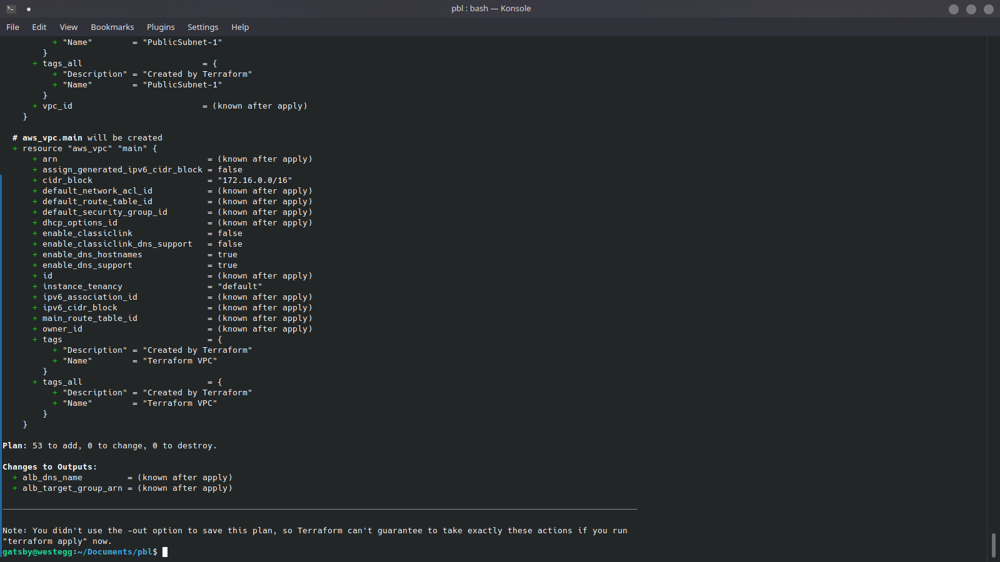

# Networking
## Private subnets and best practices
- First of all, create a locals resource block named default_tags to hold your default tags
  ```
  locals {
    default_tags = {
      Description = "Created by Terraform"
    }
  }
  ```
- Create 4 private subnets
  ```
  resource "aws_subnet" "private" { 
    count                   = var.preferred_number_of_private_subnets == null ? length(data.aws_availability_zones.available.names) : var.preferred_number_of_private_subnets
    vpc_id                  = aws_vpc.main.id
    cidr_block              = cidrsubnet(var.vpc_cidr, 4 , count.index+2)
    map_public_ip_on_launch = false
    availability_zone       = data.aws_availability_zones.available.names[count.index]
    tags = merge(
      local.default_tags,
      {
        Name = format("PrivateSubnet-%s", count.index)
      } 
    )
  }
  ```
  **BLOCKER:** To allocate cidr block using the cidrsubnet() function, increment the count.index variable by 2 (as seen above)
## Internet Gateways
- Create an internet_gateway.tf file and paste in the following:
  ```
  resource "aws_internet_gateway" "ig" {
  vpc_id = aws_vpc.main.id
  tags = merge(
    local.default_tags,
    {
      Name = format("%s-%s!", aws_vpc.main.id,"IG")
    })
  }
  ```
  The format function replaces the %s value with the values given after the comma.

## NAT Gateways
- Create one NAT Gateway and one Elastic IP to attach to the gateway
  ```
  resource "aws_eip" "nat_eip" {
  count  = var.preferred_number_of_public_subnets == null ? length(data.aws_availability_zones.available.names) : var.preferred_number_of_public_subnets   
  vpc        = true
  depends_on = [aws_internet_gateway.ig]
  tags = merge(
    local.default_tags,
    {
      Name = format("EIP-%s",var.environment)
    } 
  )
  }
  resource "aws_nat_gateway" "nat" {
    count  = var.preferred_number_of_public_subnets == null ? length(data.aws_availability_zones.available.names) : var.preferred_number_of_public_subnets   
    allocation_id = aws_eip.nat_eip[count.index].id
    subnet_id     = element(aws_subnet.public.*.id, 0)
    depends_on    = [aws_internet_gateway.ig]
    tags = merge(
      local.default_tags,
      {
        Name   =  format("Nat-%s",var.environment)
      } 
    )
  }
  ```
  The *depends_on* attribute tells Terraform to create the Internet gateway before create the NAT gateway, as the NAT gateway depends on it.

## AWS Routes
- Create public and private route tables for the public and private subnets respectiely, and ensure they are properly tagged.
  ```
  resource "aws_route_table" "public-rtb" {
  vpc_id = aws_vpc.main.id

  tags = merge(local.default_tags, {
      Name = "Public-rtb"
    })
  }

  resource "aws_route" "r" {
    route_table_id            = aws_route_table.public-rtb.id
    destination_cidr_block    = "0.0.0.0/0"
    gateway_id = aws_internet_gateway.ig.id
  }
  resource "aws_route_table_association" "public" {
    count = length(aws_subnet.public[*].id)
    subnet_id      = element(aws_subnet.public[*].id, count.index)
    route_table_id = aws_route_table.public-rtb.id
  }

  resource "aws_route_table" "private-rtb" {
    vpc_id = aws_vpc.main.id

    tags = merge(local.default_tags, {
      Name = "Private-rtb"
    })
  }
  resource "aws_route" "r2" {
    route_table_id            = aws_route_table.private-rtb.id
    destination_cidr_block    = "0.0.0.0/0"
    nat_gateway_id = aws_nat_gateway.nat.id
  }
  resource "aws_route_table_association" "private" {  
    count = length(aws_subnet.private[*].id)
    subnet_id      = element(aws_subnet.private[*].id, count.index)
    route_table_id = aws_route_table.private-rtb.id
  }
  At this point, running **terraform apply** should create a VPC, two public subnets, four private subnets, one internet gateway, one EIP, one NAT gateway and one two route tables.
- Add the following entries to your default_tags block:
  ```
  Environment = production
  Billing Account = 001937782373
  Owner Email = infradev-team@darey.io
  ```
  **BLOCKER:** To associate multiple subnets to a route table using a single *aws_route_table_association* resource block, add a count argument that returns the length of the aws_subnet resource created earlier and use the *element* function to pick each at a time.
## AWS Identity and Access Management
- Create AssumeRole, add the following block to a new file called *security.tf*
  ```
  resource "aws_iam_role" "ec2_instance_role" {
  name = "ec2_instance_role"
  assume_role_policy = jsonencode({
      "Version": "2012-10-17",
      "Statement": [
          {
          "Action": "sts:AssumeRole",
          "Principal": {
              "Service": "ec2.amazonaws.com"
          },
          "Effect": "Allow",
          "Sid": ""
          }
      ]
  })
  tags = {
      Name = "aws assume role"
      Environment = var.environment
      }
  }
- Create IAM Policy
  ```
  resource "aws_iam_policy" "policy" {
    name        = "ec2_instance_policy"
    description = "A test policy"
    policy = <<EOF
    {
    "Version": "2012-10-17",
    "Statement": [
        {
        "Action": [
            "ec2:Describe*"
        ],
        "Effect": "Allow",
        "Resource": "*"
        }
    ]
    }
    EOF
    tags = {
        Name = "aws assume policy"
        Environment = var.environment
    }
  }
- Attach the policy to the IAM Role
  ```
  resource "aws_iam_role_policy_attachment" "test-attach" {
    role       = aws_iam_role.ec2_instance_role.name
    policy_arn = aws_iam_policy.policy.arn
  }
  ```
- Create an Instance Profile for the IAM Role
  ```
  resource "aws_iam_instance_profile" "ip" {
      name = "aws_instance_profile_test"
      role =  aws_iam_role.ec2_instance_role.name
  }
  ```
  **BLOCKER:** I had to wrap the policies in a *jsonencode()* block because I kept getting an invalid policy error.

## Create an internet facing Application Load Balancer
- Create a security group for the ALB in the **security_groups.tf** file:
  ```
  resource "aws_security_group" "alb-sg" {
    name   = "alb-sg"
    vpc_id = aws_vpc.main.id
    ingress {
      cidr_blocks = [ "0.0.0.0/0" ]
      description = "ALB security group"
      from_port = 80
      protocol = "HTTP"
      to_port = 80
      self = false
    }
    ingress {
      cidr_blocks = [ "0.0.0.0/0" ]
      description = "ALB security group"
      from_port = 443
      protocol = "HTTPS"
      to_port = 443
      self = false
    }
    egress {
      cidr_blocks = [ "0.0.0.0/0" ]
      from_port = 0
      protocol = "-1"
      to_port = 0
      self = false
    }
    tags = {
        Name = "ALB-SG"
        Environment = var.environment
    } 
  }
  ```
- Create bastion ALB
  ```
  resource "aws_lb" "bastion-alb" {
    name     = "bastion-alb"
    internal = false
    security_groups = [
      aws_security_group.my-alb-sg.id,
    ]
    subnets = [
      aws_subnet.public[0].id,
      aws_subnet.public[1].id
    ]
    tags = {
      Name = "bastion-alb"
    }
    ip_address_type    = "ipv4"
    load_balancer_type = "application"
  }
  ```
- Create a target group
  ```
  resource "aws_lb_target_group" "bastion-target-group" {
    health_check {
      interval            = 10
      path                = "/"
      protocol            = "HTTP"
      timeout             = 5
      healthy_threshold   = 5
      unhealthy_threshold = 2
    }

    name        = "bastion-tg"
    port        = 80
    protocol    = "HTTP"
    target_type = "instance"
    vpc_id      = aws_vpc.main.id
  }
  ```
- Createa a Listener for the target group
  ```
  resource "aws_lb_listener" "my-test-alb-listner" {
    load_balancer_arn = aws_lb.bastion-alb.arn
    port              = 80
    protocol          = "HTTP"

    default_action {
      type             = "forward"
      target_group_arn = aws_lb_target_group.bastion-target-group.arn
    }
  }
  ```
- Add the following lines to *output.tf* file:
  ```
  output "alb_dns_name" {
  value = aws_lb.bastion-alb.dns_name
  }

  output "alb_target_group_arn" {
    value = aws_lb_target_group.bastion-target-group.arn
  }
  ```
- Create a security group for the bastion instances to use in your launch template
  ```
  resource "aws_security_group" "bastion_sg" {
    name = "vpc_web_sg"
    description = "Allow incoming SSH connections."

    ingress {
        description = "SSH"
        from_port   = 22
        to_port     = 22
        protocol    = "tcp"
        cidr_blocks = ["0.0.0.0/0"]
    }

    egress {
        from_port   = 0
        to_port     = 0
        protocol    = "-1"
        cidr_blocks = ["0.0.0.0/0"]
    }

    vpc_id = aws_vpc.main.id

    tags = {
        Name = "Bastion-SG"
        Environment = var.environment
    } 
  }
  ```  
- Create bastion launch template
  ```
  resource "aws_launch_template" "BastionLT" {
    name = "BastionLT"
    image_id = var.bastion_ami
    vpc_security_group_ids = [aws_security_group.bastion_sg.id]
    user_data = base64encode(
        <<EOF
        #!/bin/bash
        yum update -y
        yum install -y ansible git
        EOF
    )
    instance_type = "t2.micro"
    lifecycle {
      create_before_destroy = true
    }
    key_name = aws_key_pair.Dare.key_name
  }
  ```
  **BLOCKER:** Wrap the user data in *base64encode()* function to prevent invalid user data error as seen above.
- Create the ASG itself
  ```
  resource "aws_autoscaling_group" "Bastion_asg" {
    vpc_zone_identifier  = [
      aws_subnet.public[0].id,
      aws_subnet.public[1].id
    ]
    target_group_arns    = [aws_lb_target_group.bastion-target-group.arn]
    health_check_type    = "EC2"

    min_size = 2
    max_size = 10

    launch_template {
      id = aws_launch_template.BastionLT.id
      version = "$Latest"
    }

    tag {
      key                 = "Name"
      value               = "Bastion-asg"
      propagate_at_launch = true
    }
  }
  ```
  Create each of the above resource for the various applications(Nginx, tooling, wordpress, etc) following project 15 architecture.

## Upload SSH Key to AWS EC2 Keypairs
- Add the following block to keypair.tf file:
  ```
  resource "aws_key_pair" "Dare" {
    key_name   = "Dare"
    public_key = file("/path/to/id_rsa.pub")
  }
  ```
- Add EC2 configuration to ec2.tf:
  ```
  resource "aws_instance" "bastion" {
    count  = var.preferred_number_of_public_subnets == null ? length(data.aws_availability_zones.available.names) : var.preferred_number_of_public_subnets   
    key_name      = aws_key_pair.Dare.key_name
    ami           = var.bastion_ami
    instance_type = "t2.micro"
    vpc_security_group_ids = [
        aws_security_group.bastion_sg.id
    ]
    iam_instance_profile = aws_iam_instance_profile.ip.name
    subnet_id = element(aws_subnet.public.*.id,count.index)
    associate_public_ip_address = true
    source_dest_check = false
    tags = {
        Name = "Bastion-Test${count.index}"
    }
  }
  ```
  ** Set var.bastion_ami to "ami-0db9a12ec65f80ea2" in your variables.tf file

- Create internal facing lb for your webservers:
  ```
  resource "aws_lb" "tooling-alb" {
    name     = "tooling"
    internal = true
    security_groups = [
      aws_security_group.alb-sg.id,
    ]
    subnets = [
      aws_subnet.private[0].id,
      aws_subnet.private[1].id
    ]
    tags = {
      Name = "Tooling-ALB"
    }
    ip_address_type    = "ipv4"
    load_balancer_type = "application"
  }
  ```
- Create a target group for the ALB
  ```
  resource "aws_lb_target_group" "bastion-target-group" {
    health_check {
      interval            = 10
      path                = "/"
      protocol            = "HTTP"
      timeout             = 5
      healthy_threshold   = 5
      unhealthy_threshold = 2
    }

    name        = "tooling-tg"
    port        = 80
    protocol    = "HTTP"
    target_type = "instance"
    vpc_id      = aws_vpc.main.id
  }
- Create a listener
  ```
  resource "aws_lb_listener" "tooling-alb-listener" {
    load_balancer_arn = aws_lb.tooling-alb.arn
    port              = 80
    protocol          = "HTTP"

    default_action {
      type             = "forward"
      target_group_arn = aws_lb_target_group.tooling-target-group.arn
    }
  }
  ```
- Create the autoscaling group for Tooling
  ```
  resource "aws_autoscaling_group" "Bastion_asg" {
    vpc_zone_identifier  = [
      aws_subnet.public[0].id,
      aws_subnet.public[1].id
    ]
    target_group_arns    = [aws_lb_target_group.tooling-target-group.arn]
    health_check_type    = "EC2"

    min_size = 2
    max_size = 10

    launch_template {
      id = aws_launch_template.ToolingLT.id
      version = "$Latest"
    }

    tag {
      key                 = "Name"
      value               = "Tooling-asg"
      propagate_at_launch = true
    }
  }
  ```
  ** This requires a launch template for tooling to be created before hand. Create the same resources for Wordpress

## Storage and Database
- Create a KMS Key for EFS, add the following to kms.tf
  ```
  resource "aws_kms_key" "kms" {
    description = "KMS key "
    policy = jsonencode({
    "Version": "2012-10-17",
    "Id": "kms-key-policy",
    "Statement": [
      {
        "Sid": "Enable IAM User Permissions",
        "Effect": "Allow",
        "Principal": {"AWS": "arn:aws:iam::${var.account_no}:root"},
        "Action": "kms:*",
        "Resource": "*"
      }
    ]
  })
  }
  resource "aws_kms_alias" "alias" {
    name          = "alias/kms"
    target_key_id = aws_kms_key.kms.key_id
  }
  ```
- Create EFS security group in *security_groups.tf* file
  ```
  resource "aws_security_group" "EFS-SG" {
    vpc_id      = aws_vpc.main.id
    name        = "EFS-SG"
    description = "Allow NFS Traffic"

    ingress {
      from_port   = "2049"
      to_port     = "2049"
      protocol    = "tcp"
      cidr_blocks = [var.vpc_cidr]
    }
    egress {
      from_port = 0
      to_port   = 0
      protocol  = "-1"
      cidr_blocks = [var.vpc_cidr]
    }

    tags =  {
      Name = "efs-SG"
    }
  }
  ```
- Create the EFS itself
  ```
  resource "aws_efs_file_system" "efs" {
    tags =  {
      Name = "efs"
    }
    encrypted = true
    kms_key_id = "${var.kms_arn}${aws_kms_key.kms.key_id}"
  }
  ```
- Create mount points, one per AZ
  ```
  resource "aws_efs_mount_target" "mounta" {
    file_system_id  = aws_efs_file_system.efs.id
    subnet_id       = aws_subnet.private[2].id
    security_groups = [aws_security_group.EFS-SG.id]
  }

  resource "aws_efs_mount_target" "mountb" {
    file_system_id  = aws_efs_file_system.efs.id
    subnet_id       = aws_subnet.private[3].id
    security_groups = [aws_security_group.EFS-SG.id]
  }
  ```
- Create security group for MySQL RDS
  ```
  resource "aws_security_group" "myapp_mysql_rds" {
    name        = "secuirty_group_web_mysqlserver"
    description = "Allow access to MySQL RDS"
    vpc_id      = aws_vpc.main.id

    ingress {
      from_port = 3306
      to_port = 3306
      protocol = "tcp"
      security_groups = [aws_security_group.web_sg.id]
    }

    tags = {
      Name = "rds_secuirty_group"
    }
  }
  ```
- Create RDS db subnet group 
  ```
  resource "aws_db_subnet_group" "rds-subnet" {
    name       = "rds-subnet-group"
    subnet_ids = [aws_subnet.private[2].id, aws_subnet.private[3].id]

    tags = {
      Name = "My DB subnet group"
    }
  }
  ```
- Create the RDS itself
  ```
  resource "aws_db_instance" "db" {
    allocated_storage    = 20
    storage_type         = "gp2"
    engine               = "mysql"
    engine_version       = "5.7"
    instance_class       = "db.t2.micro"
    name                 = "mydb"
    username             = "admin"
    password             = "admin1234"
    parameter_group_name = "default.mysql5.7"
    db_subnet_group_name = aws_db_subnet_group.rds-subnet.name
    skip_final_snapshot  = true
    multi_az             = "false"
  }


# Additional Tasks
## 1. Networking Concepts
- IP address: This is a numerical address, such as 172.0.0.0 used to identify a device in a network, whether local or on the internet.
- Subnets: These are networks within a network. It is a logical subdivision of IP addresses in a network.
- Classless Inter Domain Routing (CIDR notation) is a way of representing an IP address together with its network mask.
- IP routing determines the sets of protocols used when transferring and receiving data within a network and across several networks.
- An AWS Internet Gateway is a service within a VPC that allows the VPC to connect to the internet.
- A NAT (Network Address Translation) Gateway is a device attached to a private subnet that allows instances in that subnet to connect to services outside a VPC but does not allow services to connect to the instances over the internet.
## 2. OSI Model and TCP/IP Suite
The OSI model outlines the standard for communications in general, whether wired or otherwise. The TCP/IP model describes protocols used for communication over the internet.

## 3. Assume Role Policy and Role Policy
Assume role grants the principal declared in the role temporary security keys to access AWS resources. The role policy defines the permissions granted to the user or role the policy is attached to.
