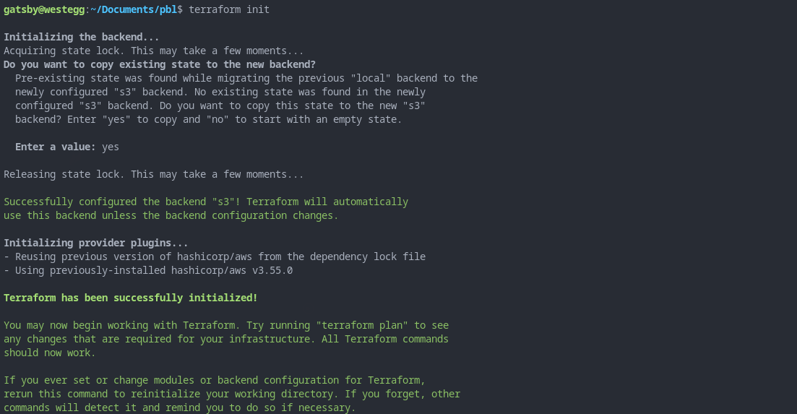
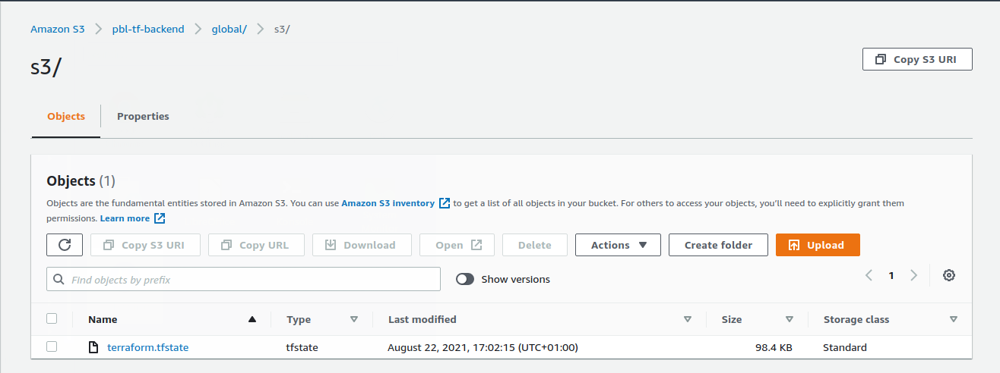
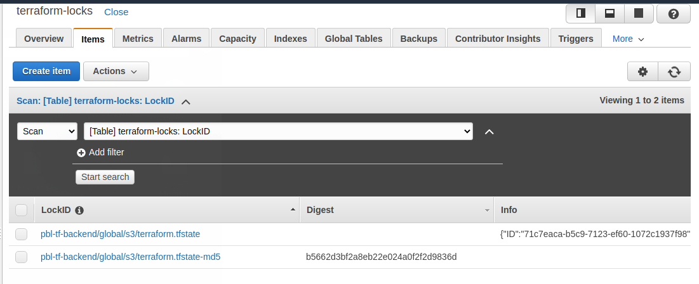
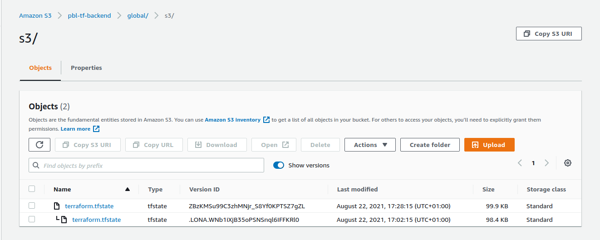
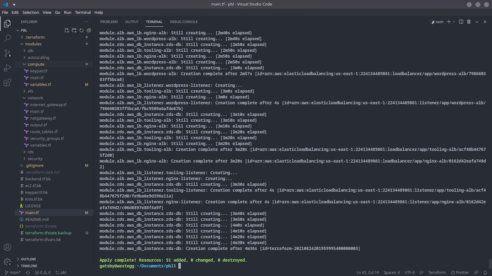

# Introducing Backend on S3
- ## Add S3 and DynamoDB resource blocks
  - S3 resource block (should go in **backend.tf** file)
  ```
  resource "aws_s3_bucket" "terraform_state" {
    bucket = "dev-terraform-bucket"
    # Enable versioning so we can see the full revision history of our state files
    versioning {
      enabled = true
    }
    # Enable server-side encryption by default
    server_side_encryption_configuration {
      rule {
        apply_server_side_encryption_by_default {
          sse_algorithm = "AES256"
        }
      }
    }
  }
  ```
  ** The bucket name should be the bucket created in project 16.
  - Create a DynamoDB resource to store the **terraform.tfstate.lock.info** file
  ```
  resource "aws_dynamodb_table" "terraform_locks" {
    name         = "terraform-locks"
    billing_mode = "PAY_PER_REQUEST"
    hash_key     = "LockID"
    attribute {
      name = "LockID"
      type = "S"
    }
  }
  ```
- ## Configure S3 backend in **main.tf** file
  ```
  terraform {
    backend "s3" {
      bucket         = "dev-terraform-bucket"
      key            = "global/s3/terraform.tfstate"
      region         = "eu-central-1"
      dynamodb_table = "terraform-locks"
      encrypt        = true
    }
  }
  ```
  - Run Terraform init
  
    - Terraform state file should appear in the S3 bucket
    
    - The DynamoDB table should have an entry containing the state file too
    
  - Add Terraform output
  ```
  output "s3_bucket_arn" {
    value       = aws_s3_bucket.terraform_state.arn
    description = "The ARN of the S3 bucket"
  }
  output "dynamodb_table_name" {
    value       = aws_dynamodb_table.terraform_locks.name
    description = "The name of the DynamoDB table"
  }
  ```
  - Run **terraform apply**
  
  - The S3 bucket should now have versions of the state file
  

# When to use workspaces or directories
To separate environments with significant configuration differences, use a directory structure. Use workspaces for environments that do not greatly deviate from each other, to avoid duplication of your configurations. Try both methods in the sections below to help you understand which will serve your infrastructure best.

# Security refactoring groups with dynamic blocks.
- First add a **locals** block that contains the resources you want to use repeatedly.
  ```
  locals {
    http_ingress_rules = [{
      port = 443
      protocol = "tcp"
    },
    {
      port = 80
      protocol = "tcp"
    }
    ]
    ssh_ingress_rules = [{
      port = 22
      protocol = "tcp"
    }
    ]
  ```
- Next configure your security group resource block like below.
  ```
  resource "aws_security_group" "alb-sg" {
    name   = "alb-sg"
    vpc_id = aws_vpc.main.id
    dynamic "ingress" {
      for_each = local.http_ingress_rules

      content {
        from_port = ingress.value.port
        to_port = ingress.value.port
        protocol = ingress.value.protocol
        cidr_blocks = ["0.0.0.0/0"]
      }
    }
    tags = {
        Name = "ALB-SG"
        Environment = var.environment
    } 
  }
  ```
  The **dynamic** block is used to invoke the ingress rules and the **content** block within the dynamic is used to collect attributes for the ingress rules.

# EC2 refactoring with *map* and *lookup* function
- Add the following block to your **variables.tf** file
  ```
  variable "images" {
    type = map
    default = {
        "us-east-1" = "ami-0b0af3577fe5e3532",
        "us-west-1" = "ami-054965c6cd7c6e462"
    }
  }
  ```
  Map is a data structure that stores information in **key**-**value** pairs.
- Replace the **ami** line in the **aws_instance** resource block to use the **lookup** function.
  ```
  resource "aws_instace" "web" {
    ami  = "${lookup(var.images, var.region, "ami-0b0af3577fe5e3532")}
  }
  ```

# Conditional Expressions
We use conditional expressions to make some decisions based on a specific condition. Example:
```
resource "aws_db_instance" "read_replica" {
  count               = var.create_read_replica == true ? 1 : 0
  replicate_source_db = aws_db_instance.this.id
}
```
The **count** variable checks if the variable **create_read_replica** evaluates to **true**. If it does, it sets the value of **count** to 1 else, 0.

# Terraform Modules
- Create a modules directory in your root directory structure
- Inside the modules directory, create directories for required resources like albs, network (VPCs, subnets etc) and autoscaling.
  ```
  ├── modules
      ├── alb
      ├── autoscaling
      ├── compute
      ├── efs
      ├── network
      ├── rds
      └── security
  ```
- Refactor each module to use variables, for all the attributes that need to be configured. See the example below, for creating an instance using modules:
  * main.tf
  ```
  resource "aws_instance" "Bastion" {
    ami                         = var.bastion_ami
    instance_type               = var.instance_type
    subnet_id                   = var.subnet_id
    vpc_security_group_ids      = var.security_groups
    key_name                    = aws_key_pair.praise.key_name

    tags = {
      Name = "Bastion"
    }
  }
  ```
  * variables.tf
  ```
  variable "bastion_ami" {
    default = "ami-0b0af3577fe5e3532"
  }
  variable "security_groups" {
    type = list 
  }
  variable "instance_type" {
    type = string
    default = "t2.micro"
  }
  variable "subnet_id" {
    type = string
  }
  ```
  * keypair.tf
  ```
  resource "aws_key_pair" "praise" {
    key_name   = "praise"
    public_key = file("~/.ssh/id_rsa.pub")
  }
  ```
  * To use outputs from the resources created in your module, create an **outputs.tf** file and output the variables you wish to use.
  ```
  output "instance_ipv4" {
    value = aws_instance.Bastion.public_ip
  }
  ```
  Repeat the same procedure for each of the required modules.

# Creating the Root Module
- In the root directory of your Terraform project, replace the contents of your **main.tf** file to use modules.
  ```
  module "compute" {
    source = "./modules/compute"
    security_groups = [module.network.bastion_sg]
    subnet_id = module.network.public-subnets[0]
  }
  ```
  In the module block, indicate the source (relative or absolute path) to the module you want to use and specify inputs to the required variables you wish to configure, like above. You can pass outputs from other modules as inputs to the variables.
- To use outputs from a module, specify the module name and the name of the output variable described in your output.
  ```
  module.compute.instance_ipv4
  ```
  Create module blocks for each resource you need to create.

- Final main.tf file:
  ```
  provider "aws" {
    region = "us-east-1"
  }
  module "network" {
    source = "./modules/network"
    vpc_tags = {
        Name = "Terraform VPC"
    }
    public_subnet_tags = {
        Name = "Public subnet"
    }
    private_subnet_tags = {
        Name = "Private subnet tags"
    }
    nat_eip_tags = {
        Name = "Nat EIP"
    }
    nat_tags = {
        Name = "NAT"
    }
    ig_tags = {
        Name = "IG"
    }
  }

  module "alb" {
    source = "./modules/alb"
    vpc_id = module.network.vpc_id
    alb_security_group = ["${module.network.alb-sg}"]
    alb_subnet_ids = [module.network.public-subnets[0], module.network.public-subnets[1]]
    nginx_alb_tags = {
        Name = "Nginx ALB"
    }
    wordpress_alb_tags = {
        Name = "Wordpress ALB"
    }
    tooling_alb_tags = {
        Name = "Tooling ALB"
    }
  }

  module "compute" {
    source = "./modules/compute"
    security_groups = [module.network.bastion_sg]
    subnet_id = module.network.public-subnets[0]
  }
  module "asg" {
    source = "./modules/autoscaling"
    bastion_sg = [module.network.bastion_sg]
    bastion_subnets = [module.network.public-subnets[0],module.network.public-subnets[1]]
    bastion_tg_arn  = [module.alb.bastion-tg-arn]
  }

  module "efs" {
    source = "./modules/efs"
    efs_tags = {
        Name = "EFS"
    }
    efs_subnet_id = module.network.efs_subnets
    efs_sg = [module.network.efs_sg]
  }

  module "rds" {
    source = "./modules/rds"
    rds_subnets = [module.network.private-subnets[2],module.network.private-subnets[3]]
    rds_tags = {
        Name = "MySQL RDS"
    }
    db_name = "tooling"
    db_username = "webaccess"
    db_password = "admin1234"

  }

  module "security" {
    source = "./modules/security"
  }
  ```

Repo containing Terraform files: https://github.com/Anefu/pbl