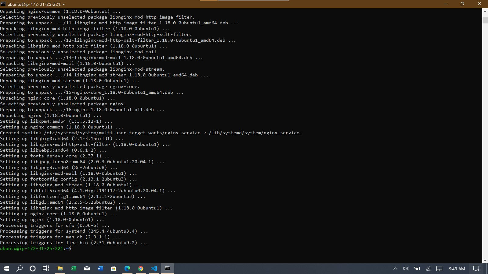
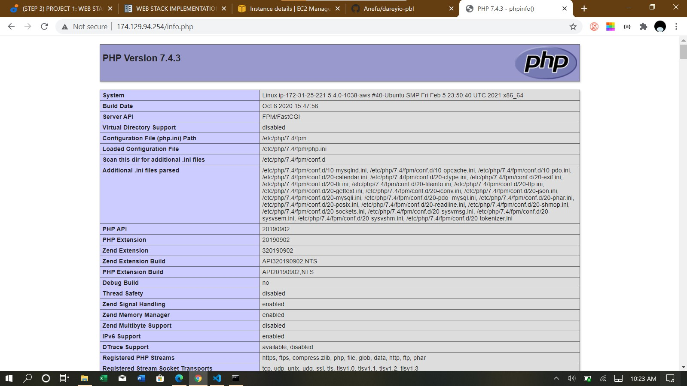
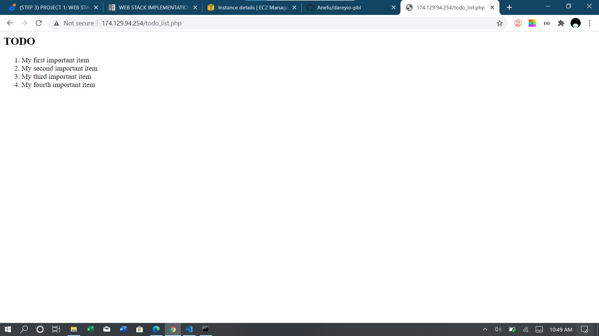

**Step 1: Install NGINX**
  - Command: sudo apt install nginx
  

**Step 2: Install and setup mysql server**
  - Commands:
    - sudo apt install mysql-server
    - sudo mysql_secure_installation
  

**Step 3: Install PHP and dependencies**
  - Command: sudo apt install php-fpm php-mysql
   (fpm - FastCGI process manager is used to handle php processing and acts as a bridge between php interpreter and the web server)

**Step 4: Configuring NGINX to use PHP Processor**
  - Commands:
    - sudo mkdir /var/www/projectlemp
    - sudo chown -R \$USER:USER /var/www/projectlemp
    - sudo vim /etc/nginx/sites-available/projectlemp (Create nginx config for projectlemp)
    - sudo ln -s /etc/nginx/sites-available/projectlemp /etc/nginx/sites-enabled/ (Creates a link to sites-enabled)
    - sudo nginx -t (Test current configurations)
    - sudo unlink /etc/nginx/sites-enabled/default (Unlink default config)
    - sudo systemctl reload nginx
  
  
**Step 5: Testing PHP with Nginx**
  - Commands:
    - vim /var/www/projectlemp/info.php (Create and edit info.php page)
  

**Step 6: Retrieving Data from MySQL Database with PHP**
  - Commands:
    - sudo mysql
    - CREATE DATABASE \`example_database`; (Create database)
    - CREATE USER 'example_user'@'%' IDENTIFIED WITH mysql_native_password BY 'password'; (Create user with mysql_native_password authentication)
    - GRANT ALL ON example_database.* TO 'example_user'@'%'; (Grant permissions to user)
    - exit
    - mysql -u example_user -p (Login with created user credentials)
    - SHOW DATABASES;
    - CREATE TABLE example_database.todo_list (mysql>     item_id INT AUTO_INCREMENT,mysql>     content VARCHAR(255),mysql>     PRIMARY KEY(item_id)mysql> ); (Create table)
    - mysql> INSERT INTO example_database.todo_list (content) VALUES ("My first important item"); (Add entries to table. Do multiple times with different values)
    - nano /var/www/projectLEMP/todo_list.php (Create and edit todo_list.php)
  

