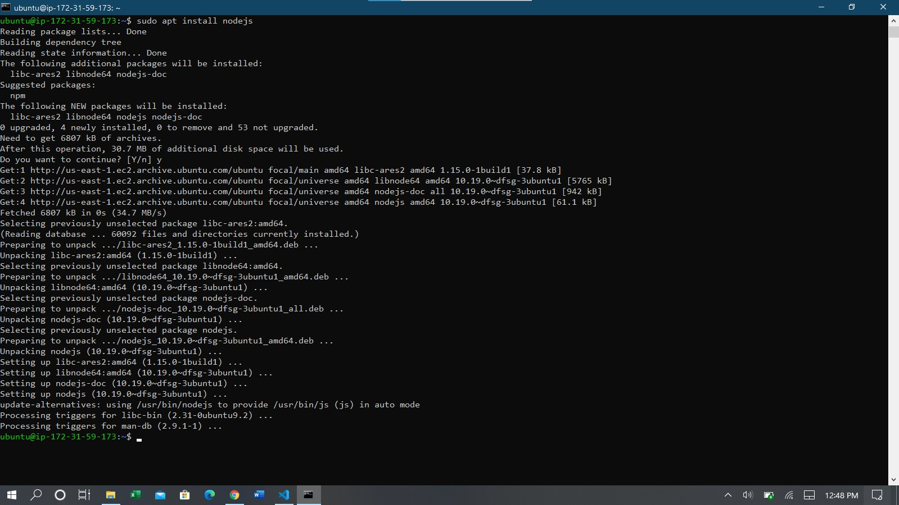
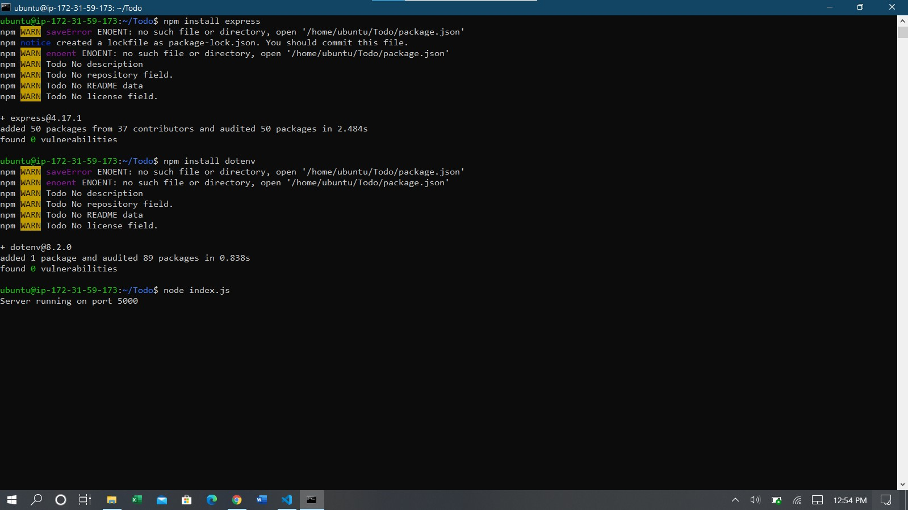
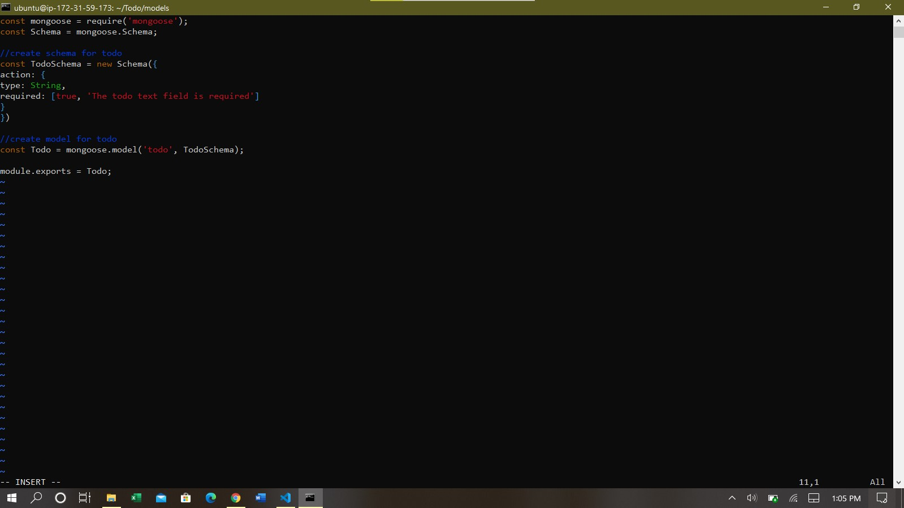
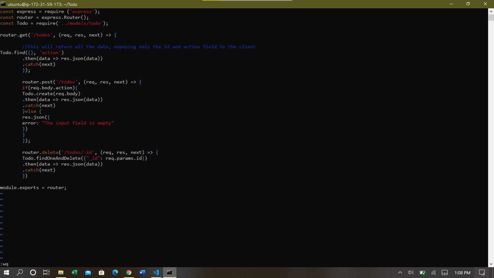
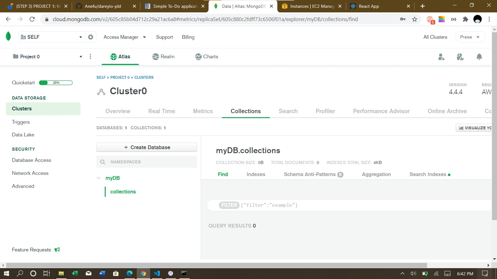
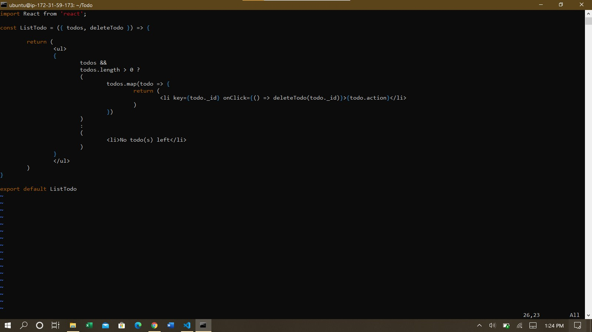
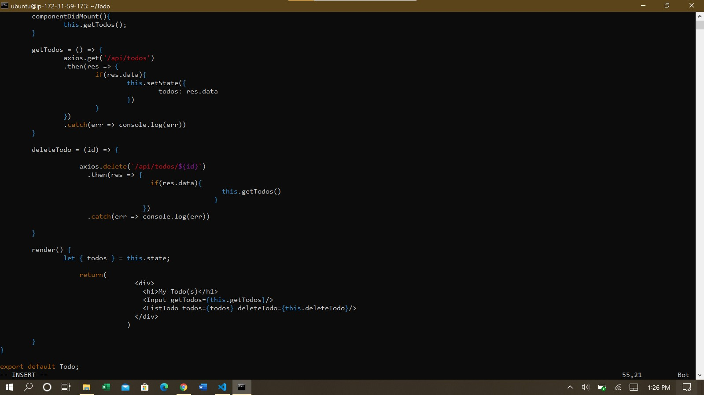
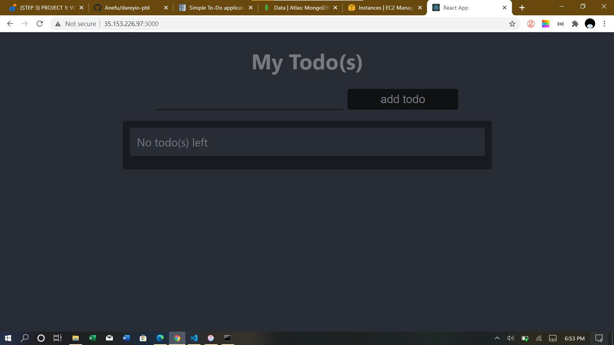

**Step 1: Backend Configuration**
  - Commands:
    - curl -sL https://deb.nodesource.com/setup_12.x | sudo -E bash -, sudo apt-get install nodejs (Update ubuntu sources list and install nodejs) 
    - mkdir Todo && cd Todo (Create directory for project)
    - npm install express (Install Express.js using npm (Node Package Manager))
    - touch index.js, npm install dotenv (Create index.js and paste in code)
    - node index.js (Start server)  
    - mkdir routes && cd routes, vim api.js (Create routes for the application)
    - npm install mongoose (node package for working with mongodb)
    - mkdir models && cd models && touch todo.js (Create models and schema for mongodb) 
    - vim routes/api.js (Edit api.js file in the Routes directory) 
    - vim .env (Edit .env file to contain DB authentication url)

    - vim index.js (Update index.js file with new code) 
**Step 2: Frontend Creation**
  - Commands:
    - npx create_react_app client
    - npm install concurrently --save-dev (For running more than one commmands concurrently)
    - npm install nodemon --save-dev (To run and monitor server)
    - vim package.json (Edit package.json file in Todo directory and configure proxy)
    - cd clients/src && mkdir components && cd components && touch Input.js ListTodo.js Todo.js (Create React components)
    - vim Input.js (Edit Input.js file)
    - cd ../.. && npm install axios (Install axios)
    - vim src/components/ListTodo.js (Edit ListTodo file) 
    - vim src/components/Todo.js (Edit Todo.js file) 
    - Create and App.js App.css and index.css files
    - npm run dev (Run app)
