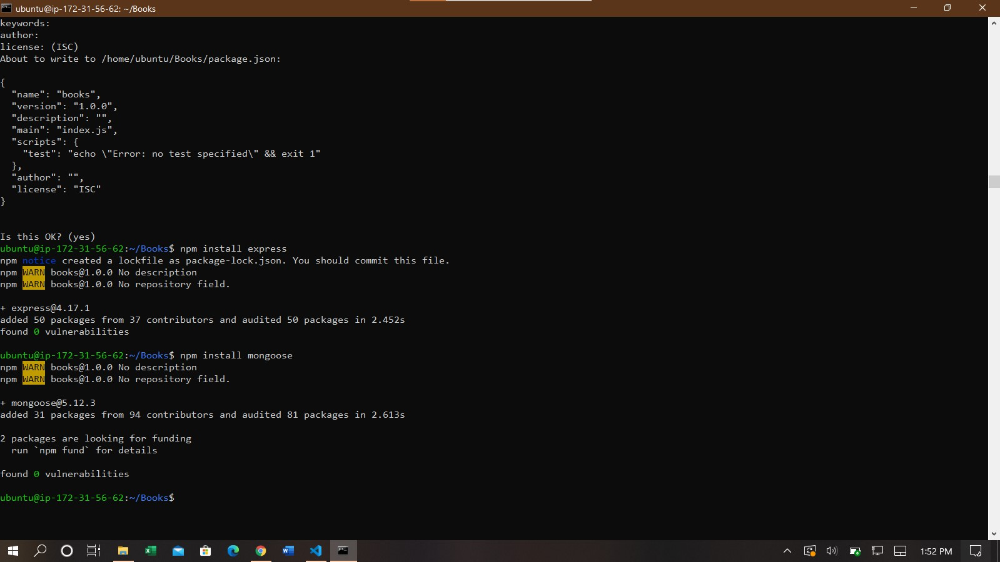
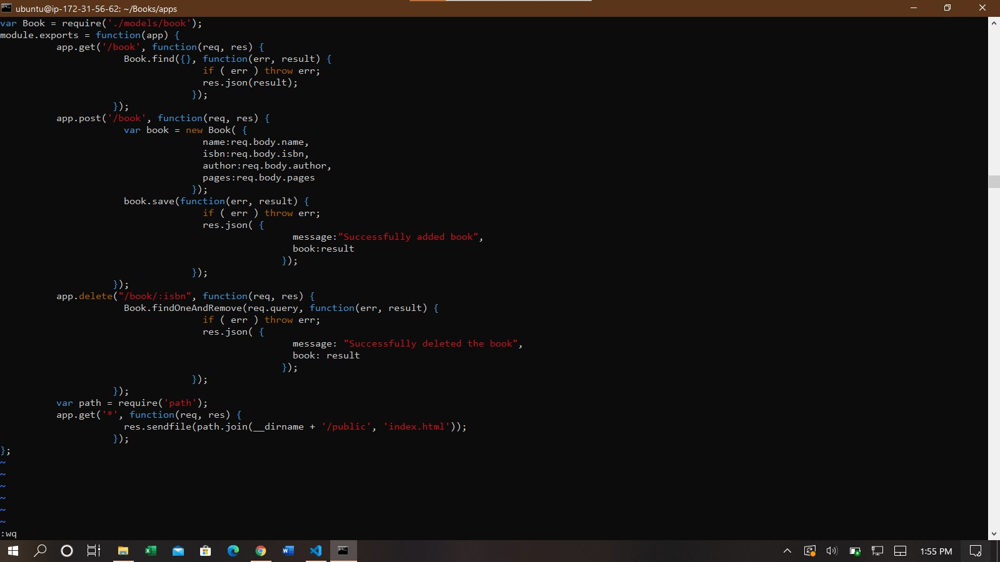
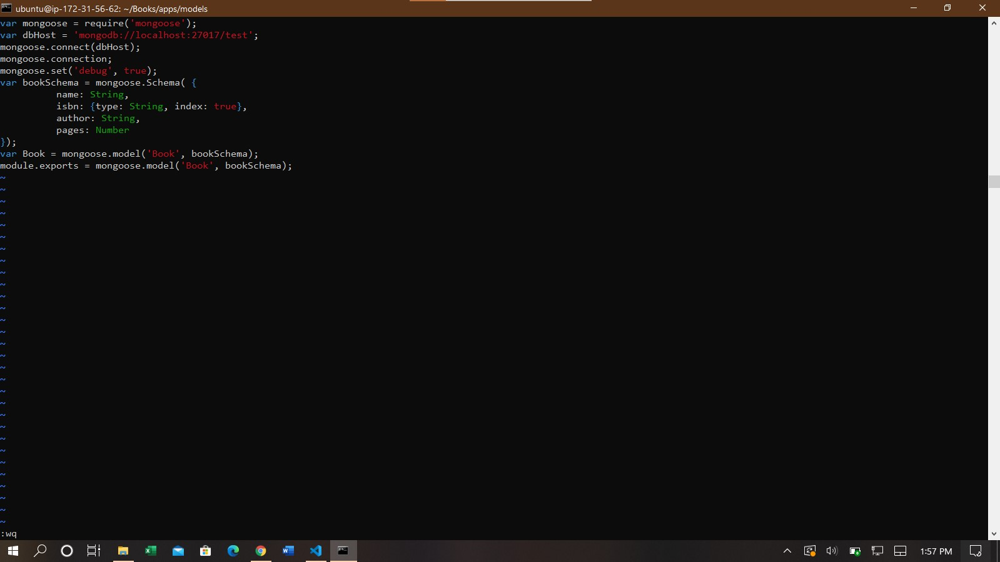
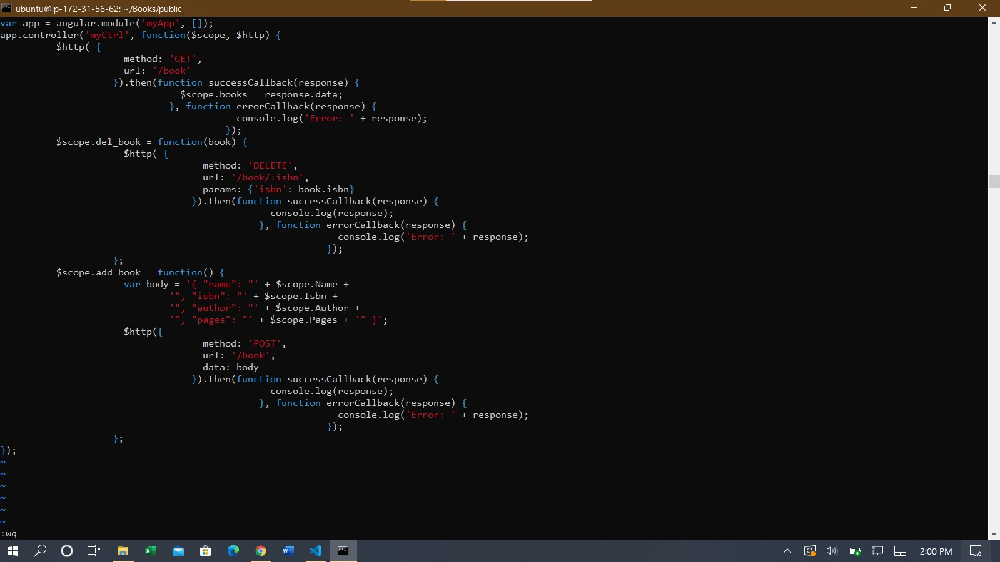
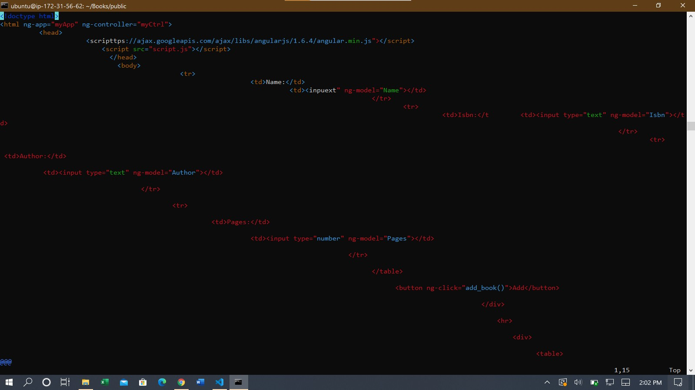
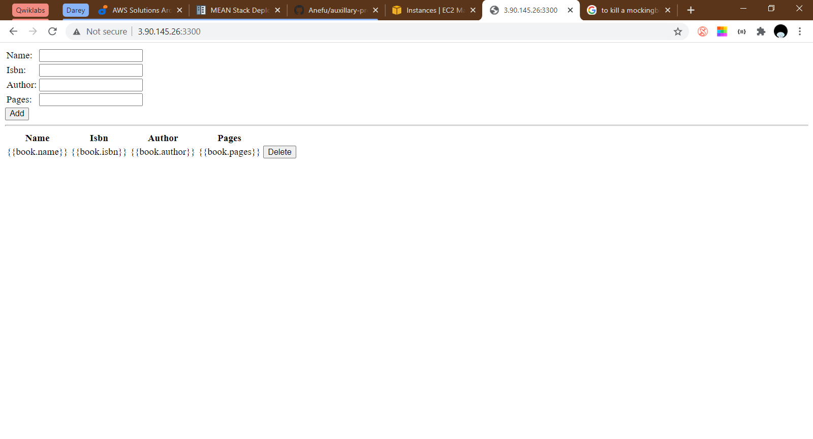

**Step 1: Install Nodejs**
  - Commands:
    - sudo apt install nodejs -y

**Step 2: Install MongoDB**
  - Commands:
    - sudo apt-key adv --keyserver hkp://keyserver.ubuntu.com:80 --recv 0C49F3730359A14518585931BC711F9BA15703C6
    - echo "deb [ arch=amd64 ] https://repo.mongodb.org/apt/ubuntu trusty/mongodb-org/3.4 multiverse" | sudo tee /etc/apt/sources.list.d/mongodb-org-3.4.list
    - sudo apt install -y mongodb
    - sudo systemctl start mongodb
    - sudo systemctl status mongodb
    - sudo apt install npm -y (Install npm)
    - sudo npm install body-parser (Process JSON requests)
    - mkdir Books && cd Books (Create project directory)
    - npm init (Initialize project) 
    - vim server.js (Edit server.js file)

**Step 3: Install Express and Setup Routes to Server**
  - Commands:
    - sudo npm install express mongoose 
    - mkdir apps && cd apps (Create apps directory)
    - vim routes.js (Create and edit routes.js file) 
    - mkdir models && cd models (Directory for MongoDB models)
    - vim book.js 

**Step 4: Access the Routes with AngularJS**
  - Commands:
    - mkdir public && cd public (Create public sub-directory in Books directory)
    - vim script.js (Create and edit script.js file) 
    - vim index.html (Create index.html file) 
    - node server.js (Start up server) 