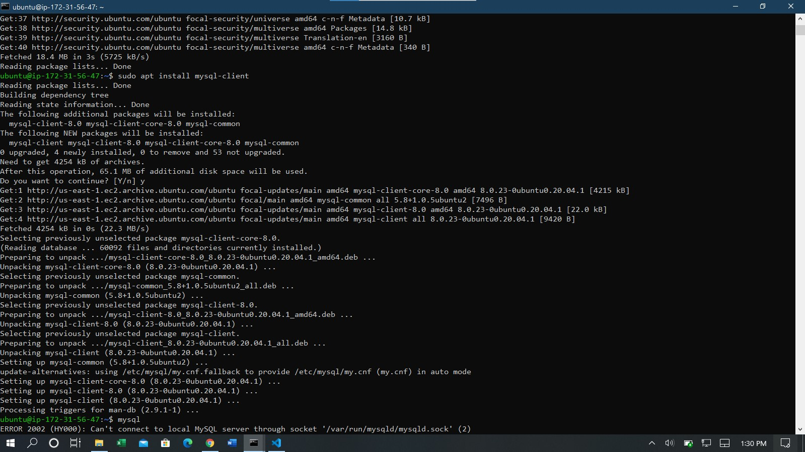
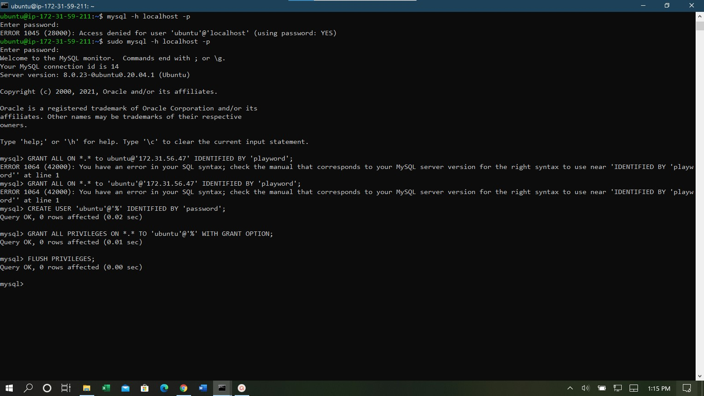
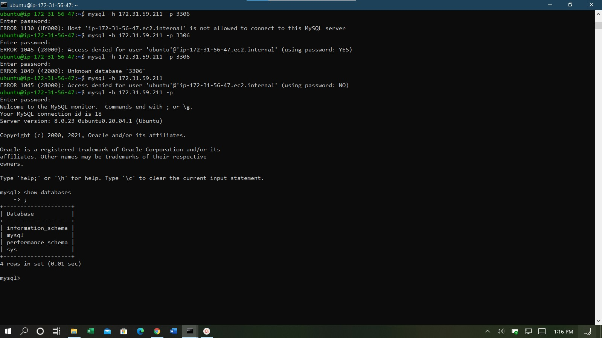

**Step 1: Install mysql-server on Linux server and mysql-client on Linux client**
  - Commands:
    - sudo apt install mysql-server (on server)
    - sudo apt install mysql-client (on client)

**Step 2: Create new mysql user for client on mysql-server machine and grant necessary privileges** 
  - Commands:
    - sudo mysql -h localhost (Enter mysql runtime)
    - CREATE USER 'user'@'%' IDENTIFIED BY 'password';
    - GRANT ALL PRIVILEGES ON \*.* TO 'user'@'%' WITH GRANT OPTION;
    - FLUSH PRIVILEGES; 

**Step 3: Configure mysql config file on server machine**
  - Commands:
    - sudo vim /etc/mysql/mysql.conf.d/mysqld.cnf (Change the bind-address from 127.0.0.1 to 0.0.0.0)
    - sudo systemctl restart mysql (Restart mysql service) 

**Step 4: Connect from client machine**
  - Commands:
    - mysql -h internal-ip-of-server -p (Connect to mysql server, enter password when prompted.) 