**Step 1: Prepare a Web Server**
  - Create a RHEL 8 server
  - Create 3 10GiB volumes and attach them to your server 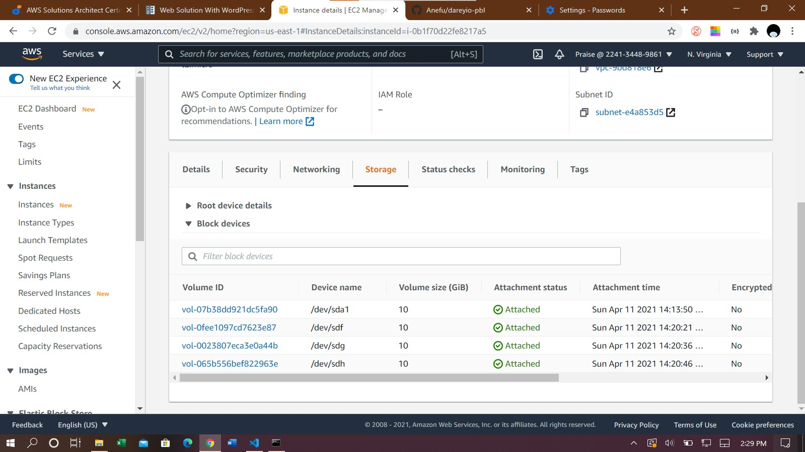
  - Create single partitions on the volumes using gdisk (sudo gdisk /dev/device-name) 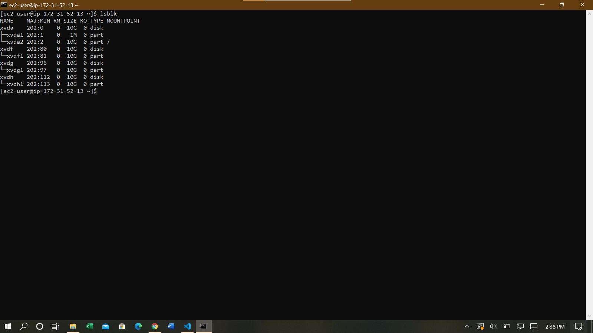
  - Install lvm2 (sudo yum install lvm2) and create physical volumes (pvcreate /dev/xvdf1) for each of the 3 volumes
  - Create a volume group of the three volumes (sudo vgcreate /dev/xvdf1 /dev/xvdh1 /dev/xvdg1) 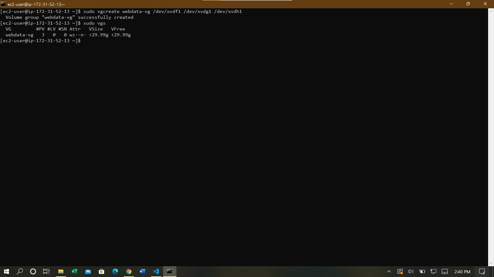
  - Create logical volumes for apps and logs (sudo lvcreate -n apps-lv -L 14G webdata-vg) 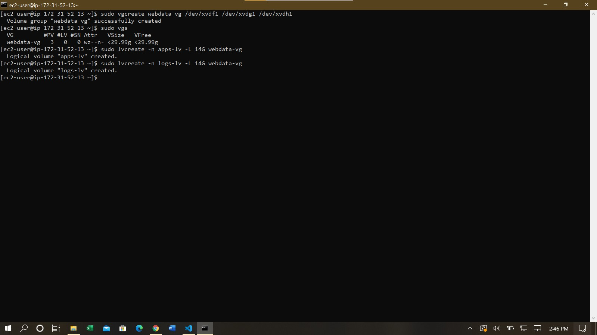
  - Format partitions to ext4 using mkfs command (sudo mkfs -t ext4 /dev/webdata-vg/apps-lv) 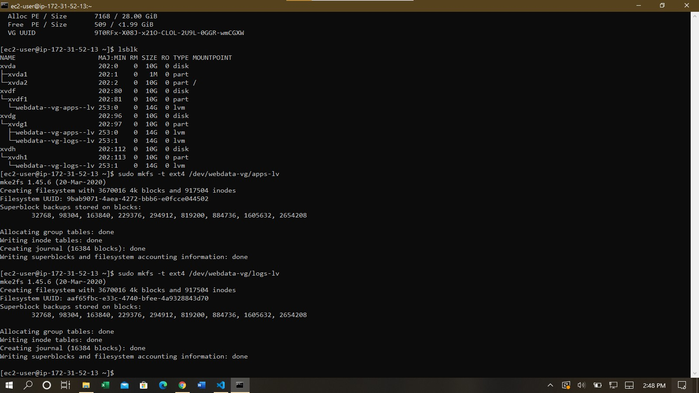
  - Create /var/www/html to mount apps-lv (sudo mkdir -p /var/www/html && sudo mount /dev/webdata-vg/apps-lv /var/www/html)
  - Create /home/recovery/logs to backup /var/log directory to mount logs-lv (Mounting will delete everything in the /var/log directory) (sudo rsync -av /var/log /home/recovery/logs && sudo mount /dev/webdata-vg/logs-lv /var/log) 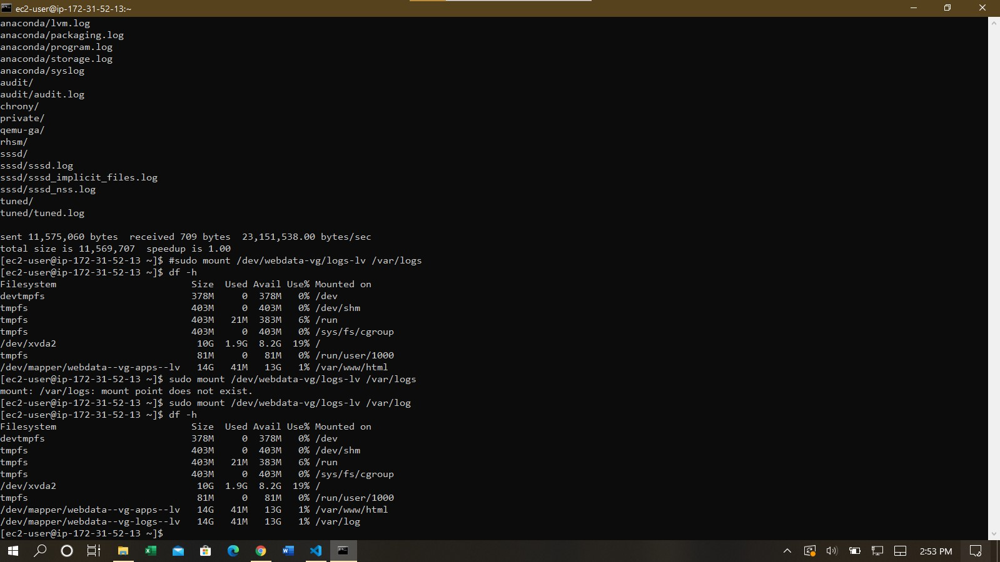
  - Edit /etc/fstab so mounted volumes would persist if server restarts using mount UUID (sudo vim /etc/fstab, sudo mount -a) 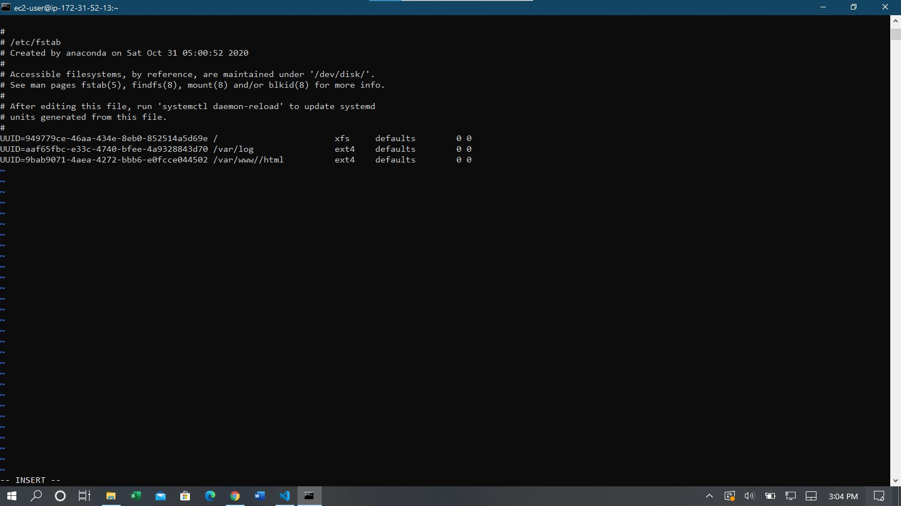

**Step 2: Prepare the Database Server**
  - Launch DB instance RHEL 8 server
  - Create three 10GiB volumes and configure as in web server 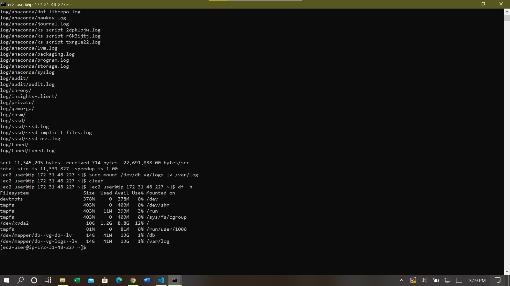

**Step 3: Install Wordpress on Web Server**
  - Install wget, Apache and dependencies (sudo yum -y install wget httpd) 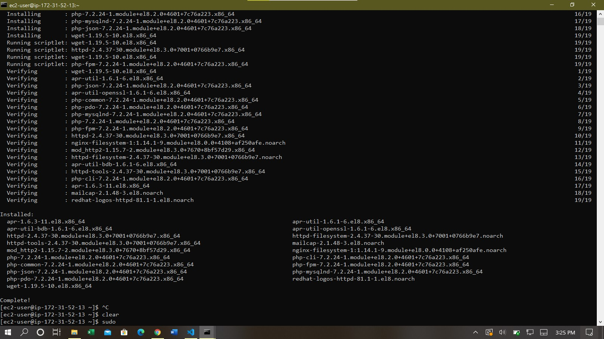
  - Start Apache (sudo systemctl enable httpd && sudo systemctl start httpd) 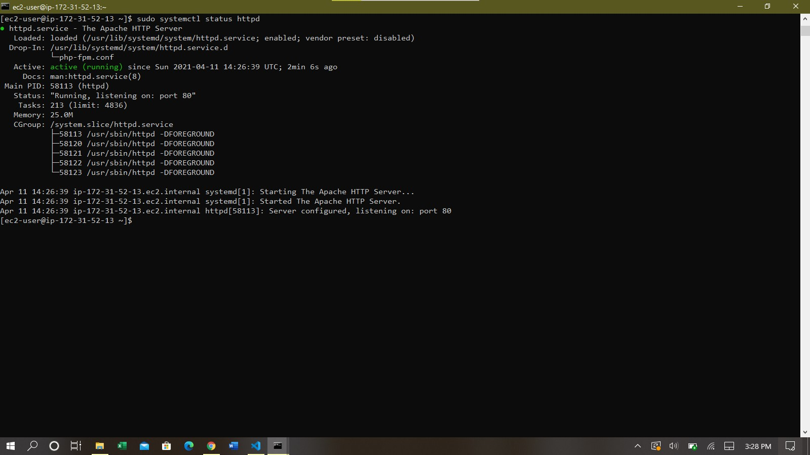
  - Install PHP and dependencies 
    - sudo yum install https://dl.fedoraproject.org/pub/epel/epel-release-latest-8.noarch.rpm
    - sudo yum install yum-utils http://rpms.remirepo.net/enterprise/remi-release-8.rpm
    - sudo yum module list php
    - sudo yum module reset php
    - sudo yum module enable php:remi-7.4
    - sudo yum install php php-opcache php-gd php-curl php-mysqlnd
    - sudo systemctl start php-fpm
    - sudo systemctl enable php-fpm
    - sudo setsebool -P httpd_execmem 1 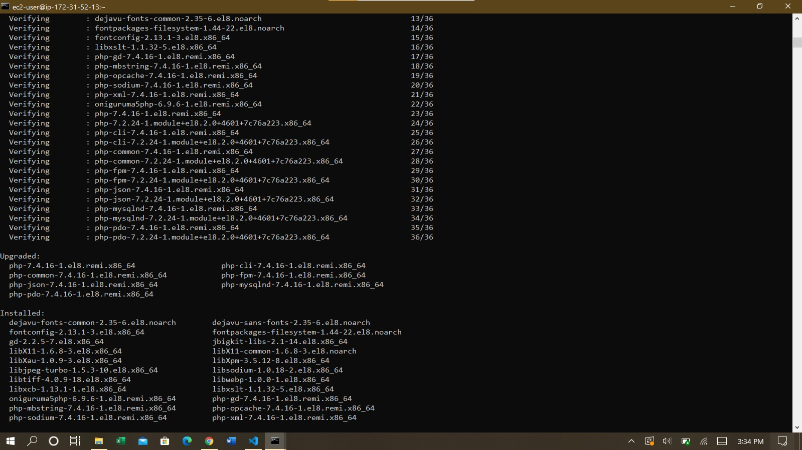
  - Download Wordpress and copy to /var/www/html 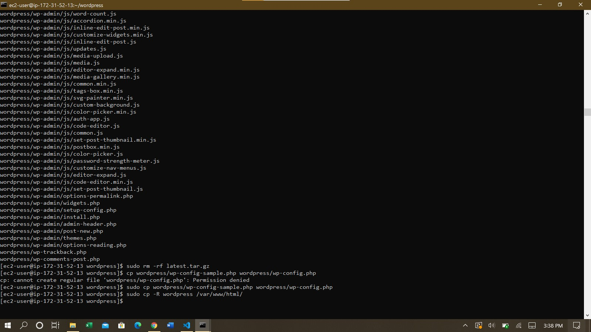
    - mkdir wordpress
cd   wordpress
sudo wget http://wordpress.org/latest.tar.gz
    - sudo tar xzvf latest.tar.gz
    - sudo rm -rf latest.tar.gz
    - sudo cp wordpress/wp-config-sample.php wordpress/wp-config.php
    - sudo cp -R wordpress /var/www/html/
  - Configure SELinux Policies
    - sudo chown -R apache:apache /var/www/html/wordpress
    - sudo chcon -t httpd_sys_rw_content_t /var/www/html/wordpress -R
    - sudo setsebool -P httpd_can_network_connect=1

**Step 4: Install MySQL on DB Server**
  - sudo yum install mysql-server (sudo systemctl enable mysqld && sudo systemctl start mysqld if service is not running) 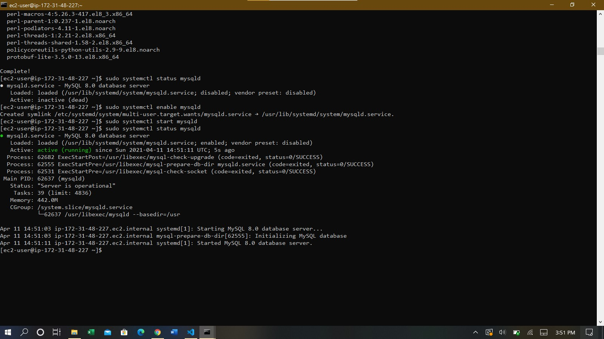

**Step 5: Configure DB to work with Wordpress**
  - sudo mysql
  - CREATE DATABASE wordpress;
  - CREATE USER `myuser`@`<Web-Server-Private-IP-Address>` IDENTIFIED BY 'mypass';
  - GRANT ALL ON wordpress.* TO 'myuser'@'<Web-Server-Private-IP-Address>';
  - FLUSH PRIVILEGES;
  - SHOW DATABASES;
  - exit 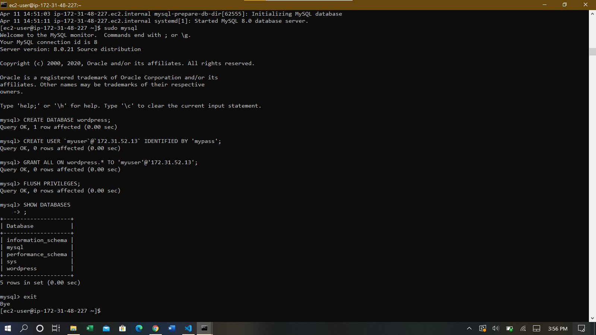

**Step 6: Configure Wordpress to connect to remote DB**
  - Install mysql on web server (sudo yum install mysql -y)
  - Test connection (mysql -u myuser -h <Web-Server-Private-IP> -p, enter password when prompted)
  - Change permissions for /var/log (sudo chown \$USER:$USER /var/log)
  - Create /etc/httpd/conf.d/wordpress.conf and configure the virtual host directives. 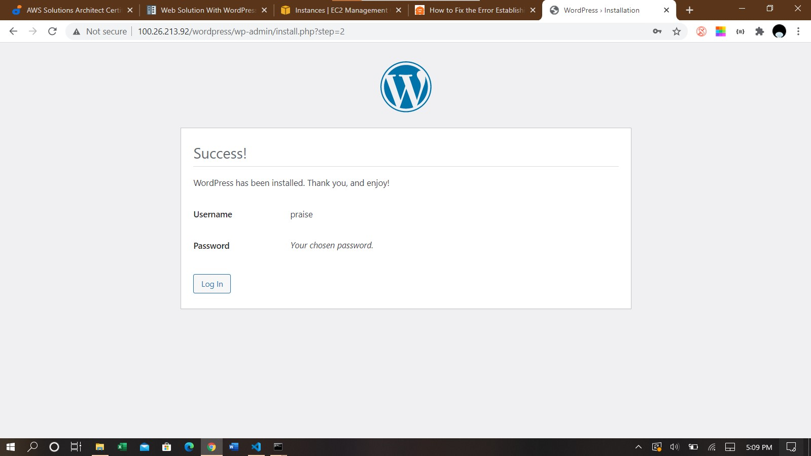