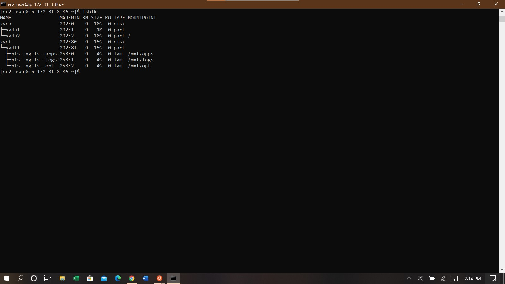
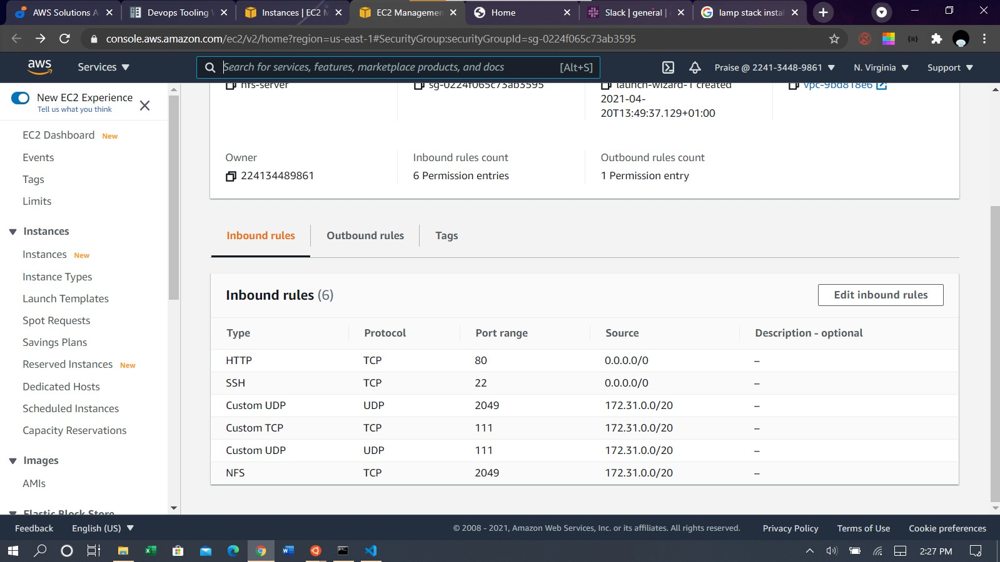
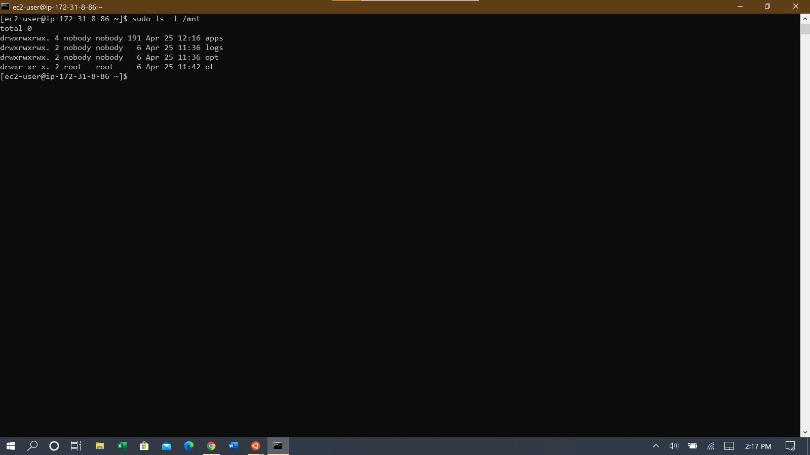
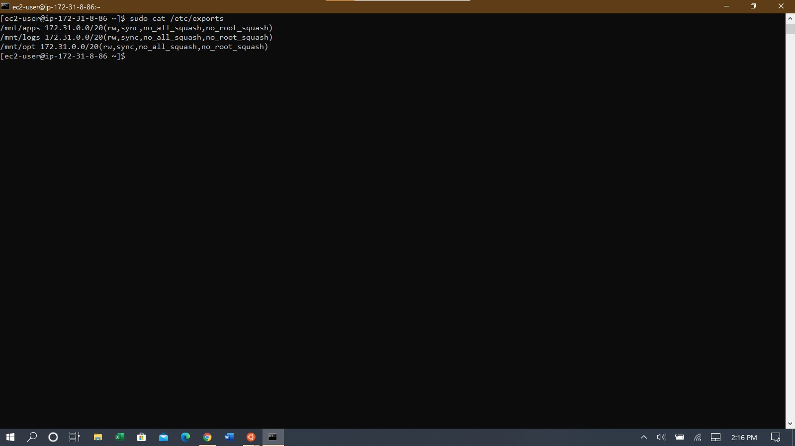
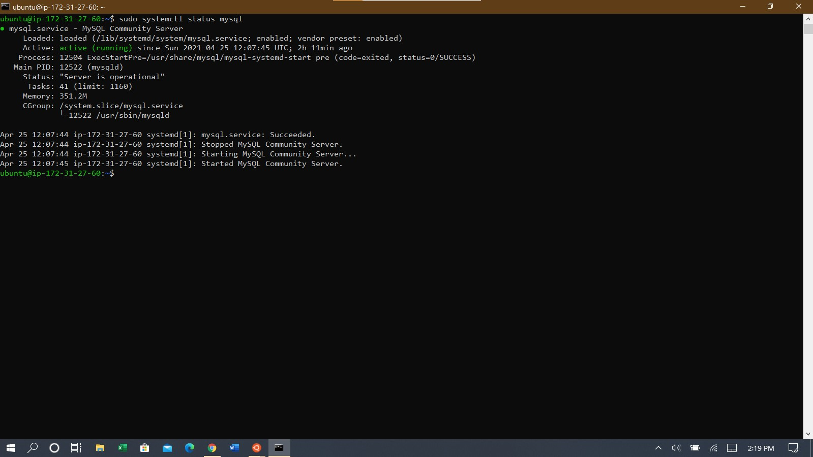
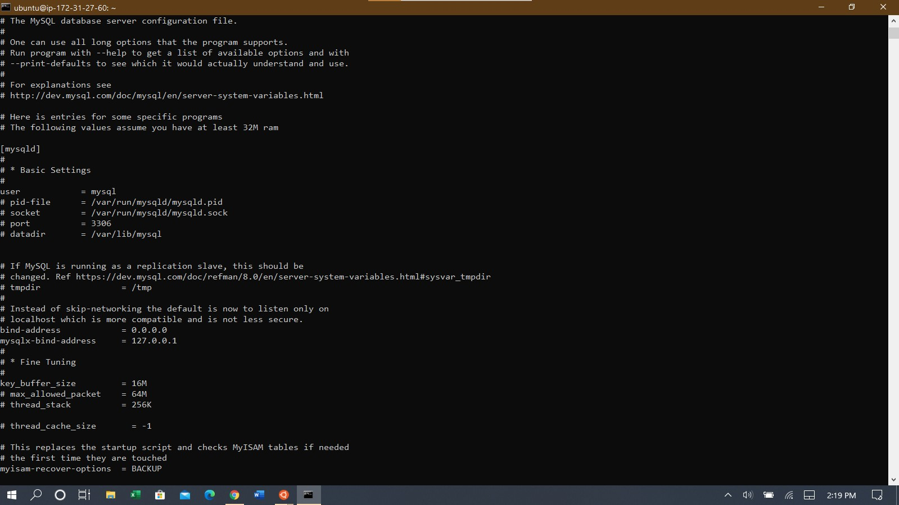
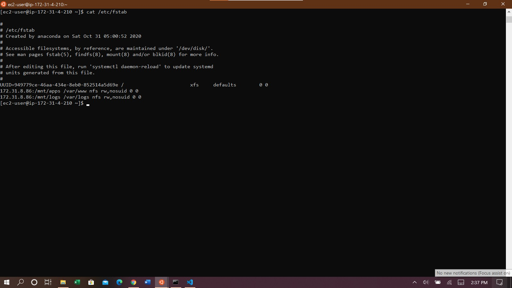
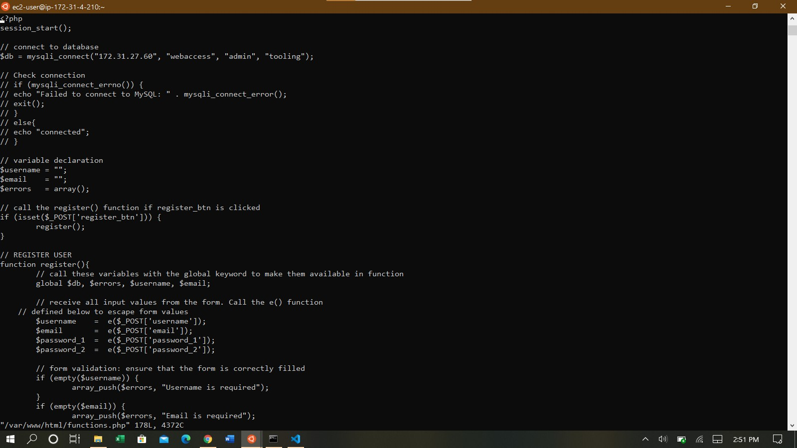
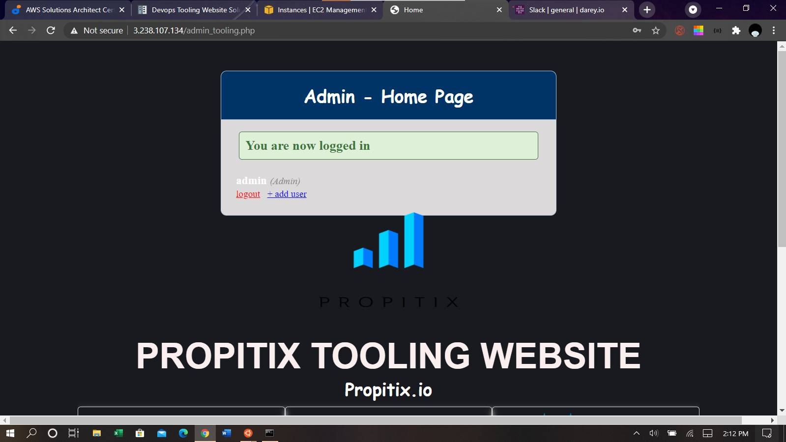

**Step 1: Prepare NFS Server**
  - Spin up RHEL 8 server
  - Configure LVM using a single 30GB EBS volume attached to the instance.
    - Format the disks as xfs
    - Create three LVMs (lv-apps, lv-opt, lv-logs)
    - Create mount points for the respective volumes (/mnt/apps, /mnt/logs, mnt/opt) 
  - Install nfs package (sudo yum install nfs-utils -y)
  - Start and enable the nfs service (sudo systemctl start nfs-server.service && sudo systemctl enable nfs-server.service)
  - Open UDP 111, TCP 111, UDP 2049 and TCP 2049 on the security group to your subnet CIDR. 
  - Edit permissions so web servers can read, write and execute files on NFS. (sudo chown nobody:nobody /mnt/apps, sudo chmod -R 777 /mnt/apps) 
  - Export mount points (sudo vi /etc/exports, /mnt/apps <Subnet-CIDR>(rw,sync,no_all_squash,no_root_squash)) 

**Step 2: Configure DB Server**
  - Start an Ubuntu Server
  - sudo apt-get update && sudo apt-get upgrade
  - Install mysql server (sudo apt install mysql)
  - Ensure server is running (sudo systemctl status mysql) 
  - Configure /etc/mysql/mysql.conf.d/mysqld.cnf to enable connection from any address (Locate bind and change from 127.0.0.1 to 0.0.0.0) 
  - Connect to mysql and create tooling db
    - sudo mysql
    - CREATE DATABASE tooling;
    - CREATE USER 'webaccess'@'webserver-CIDR' IDENTIFIED BY 'admin';
    - GRANT ALL PRIVILEGES ON tooling.* TO 'webaccess'@'webserver-CIDR' WITH GRANT OPTION;
    - FLUSH PRIVILEGES;

**Step 3: Configure Web Servers**
  - Launch a new RHEL 8 instance
  - Install nfs client (sudo yum install nfs-utils nfs4-acl-tools -y)
  - Create /var/www directory and mount the NFS server's /mnt/apps (sudo mkdir /var/www && sudo mount -t nfs -o rw,nosuid NFS-Server-Private-IP-Address:/mnt/apps /var/www)
  - Edit /etc/fstab to ensure changes persist after reboot 
  - Install Apache (sudo yum install httpd -y)
  - Fork the tooling repo to your GitHub and clone to the web servers. Copy the html folder to /var/www/html.
  - Install and configure PHP
    - Install EPEL Repo (sudo dnf install https://dl.fedoraproject.org/pub/epel/epel-release-latest-8.noarch.rpm)
    - Install yum utils and enable remi-repository (sudo dnf install dnf-utils http://rpms.remirepo.net/enterprise/remi-release-8.rpm)
    - Install PHP (sudo dnf install php php-opcache php-gd php-curl php-mysqlnd)
    - Start the php-fpm service and enable on boot-up (sudo systemctl start php-fpm && sudo systemctl enable php-fpm)
    - Instruct SELinux to allow Apache to execute the PHP code via PHP-FPM (setsebool -P httpd_execmem 1)
  - Set SELinux Enforcing to 0 (sudo setenforce 0)
  - Update functions.php file with database configuration details 
  - Apply tooling-db.sql script (mysql -h db_ip -u webaccess -p tooling < tooling-db.sql)
  - Insert new user into the database (You can also do this by editing the tooling-db.sql script appropriately.) (INSERT INTO ‘users’ (’id’, ‘username’, ‘password’, ‘email’, ‘user_type’, ‘status’) VALUES -> (1, ‘myuser’, ‘5f4dcc3b5aa765d61d8327deb882cf99’, ‘user@mail.com’, ‘admin’, ‘1’);)
  - Login to website using one of the webservers ip address 
