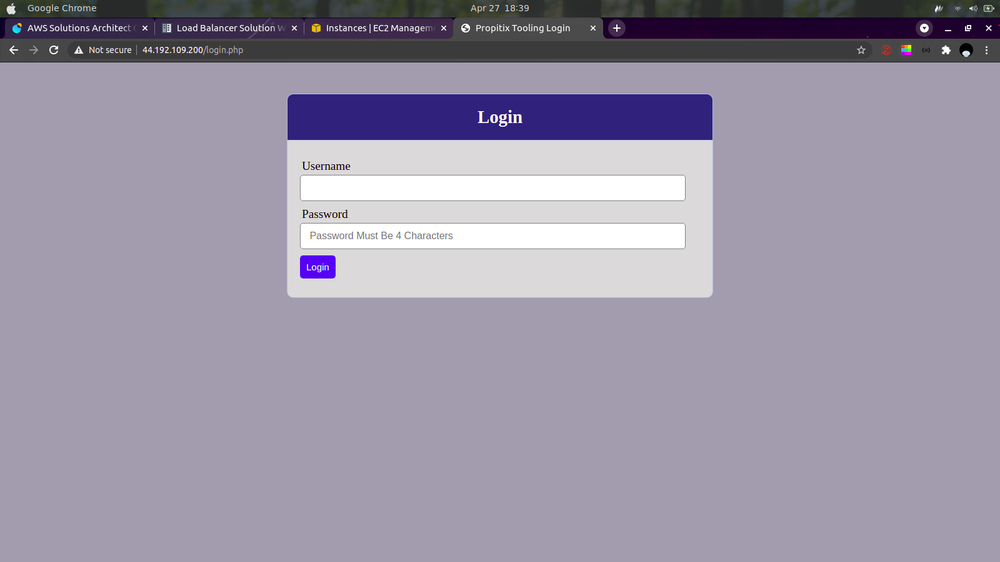
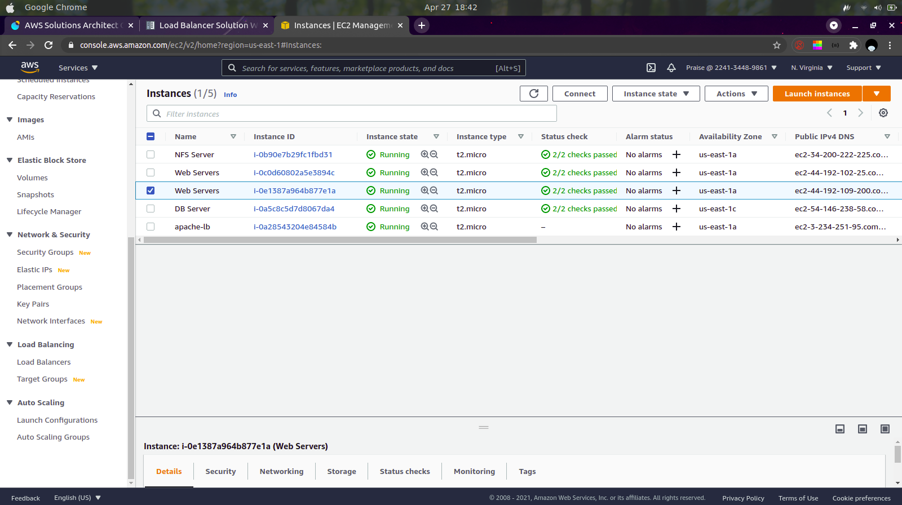
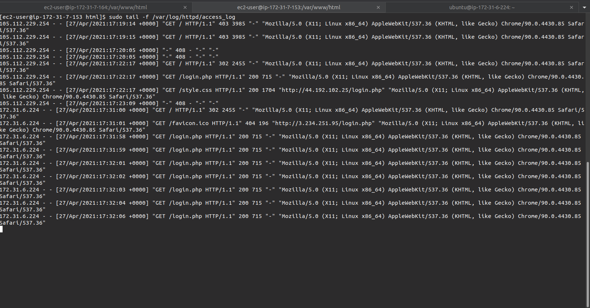

# **Step 1: Configure architecture from project 7**
    


# **Step 2: Configure Apache as a Load Balancer**
- ## Your instances should look something like this: 
      
    
  
- ## Open TCP 80 on the instance's security group
- ## Install Apache
    ```
        sudo apt update
        sudo apt install apache2 -y
        sudo apt-get install libxml2-dev
    ```
- ## Enable the following modules
    ```
        sudo a2enmod rewrite
        sudo a2enmod proxy
        sudo a2enmod proxy_balancer
        sudo a2enmod proxy_http
        sudo a2enmod headers
        sudo a2enmod lbmethod_bytraffic
    ```
- ## Restart Apache
    ```
        sudo systemctl restart apache2
    ```
- ## Add the following configuration to /etc/sites-available/000-default.conf
    ```
        <Proxy "balancer://mycluster">
               BalancerMember http://<WebServer1-Private-IP-Address>:80 loadfactor=5 timeout=1
               BalancerMember http://<WebServer2-Private-IP-Address>:80 loadfactor=5 timeout=1
               ProxySet lbmethod=bytraffic
               # ProxySet lbmethod=byrequests
        </Proxy>

        ProxyPreserveHost On
        ProxyPass / balancer://mycluster/
        ProxyPassReverse / balancer://mycluster/
    ```
- ## Verify the configuration works
    ```
    Run sudo tail -f /var/log/httpd/access_log on both servers and check the outputs (refresh your browser a couple or more times)
    ```
  

# **Optional: Configure local DNS Resolution**

- ## Edit your hosts file 
    ```
    sudo vim /etc/hosts

    Add the following line:

        <WebServer1-Private-IP-Address> Web1
        <WebServer2-Private-IP-Address> Web2
- ## Edit the /etc/sites-available/000-default.conf file
    ```
    BalancerMember http://Web1:80 loadfactor=5 timeout=1
    BalancerMember http://Web2:80 loadfactor=5 timeout=1
    ```

- ## Verify the configuration still works.


Link to implementation on YouTube: https://youtu.be/6hlSPDVm7Tg